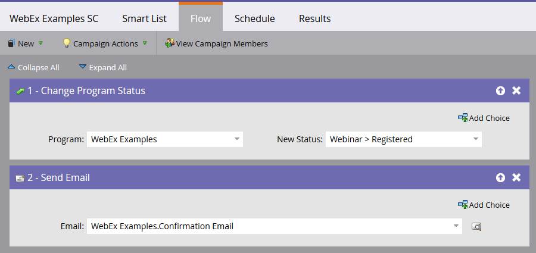
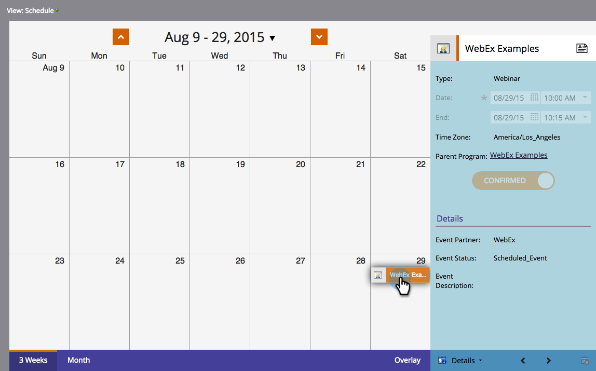

# 使用WebEx建立事件 {#create-an-event-with-webex}

>[!PREREQUISITES]
>
>* [將WebEx添加為LaunchPoint服務](/help/marketo/product-docs/administration/additional-integrations/add-webex-as-a-launchpoint-service.md)
>* [建立新事件程式](/help/marketo/product-docs/demand-generation/events/understanding-events/create-a-new-event-program.md)
>* 設定相應 [流動動作](/help/marketo/product-docs/core-marketo-concepts/smart-campaigns/flow-actions/add-a-flow-step-to-a-smart-campaign.md) 跟蹤項目
>* 確保您正在使用Webex事件（經典）

首先在WebEx事件中心建立Webex事件。 Marketo只使用特定設定和欄位來整合，我們稍後將介紹。 有關您可能要為WebEx配置的其他欄位的說明，請參見 [《 WebEx事件中心使用手冊》](https://www.cisco.com/c/dam/en/us/td/docs/collaboration/meeting_center/wbs298/wx_ec_host_ug.pdf)。

>[!IMPORTANT]
>
>Marketo Engage僅支援在Webex Events(classic)中建立的事件。 Marketo不支援此時在Webex事件（新建）中建立的事件。

## 基本資訊 {#basic-information}

* **事件名稱 —** 此名稱將在Marketo查看。
* **未列出複選框**

   * 建議你 **不** 列出您的活動。 這將確保所有人通過您的Marketo登錄頁註冊。 通過Marketo以外的機制註冊的人員在活動結束後，只有在他們參加活動時才在Marketo出席。
   * 如果選擇列出事件，則該事件將出現在訪問您的事件中心網站的任何人的「事件清單」頁面中。

* **註冊 —** 選中此框可設定為「必需」。 您將使用Marketo表單/登錄頁來捕獲將被推送到WebEx的註冊資訊。
* **事件密碼** — （可選）如果使用此欄位，請確保在確認電子郵件中包含此欄位！

## 日期和時間 {#date-time}

* **開始日期**  — 輸入開始日期。 這可在Marketo觀看。

* **開始時間**  — 輸入開始時間。 這可在Marketo觀看。

* **估計持續時間**  — 指定事件的持續時間。 這可在Marketo觀看。

* **時區**  — 輸入適用的時區。 他們將在Marketo看到。

## 音頻會議設定 {#audio-conference-settings}

這些設定僅駐留在WebEx中。 它們在Marketo不被使用或可查看，但它們可能對您的網路研討會非常重要，因此請仔細檢查它們！

## 事件說明和選項  {#event-description-options}

以下選項在Marketo使用或可查看。 其他欄位僅駐留在WebEx中。

* **說明**  — 輸入說明。 這在Marketo是可以看到的，但是不能修改。
* **事後調查** -Marketo目前無法在WebEx事件後調查中獲取資訊。
* **目標URL**  — （可選）可以輸入Marketo登錄頁的URL作為會話結束後顯示的目標URL。

## 與會者和註冊 {#attendees-registration}

您將使用Marketo活動控制邀請清單、註冊表和其他電子郵件。 Marketo不支援其他功能，包括：

* **最大註冊者數**  — 當前 **不** 支援使用Marketo-WebEx整合。  使用Marketo的「待批准」進展狀態，可手動審批註冊人。

* **需要註冊ID**  — 當前支援使用Marketo-WebEx整合。 您可以使用Marketo發送活動確認電子郵件。 當人員註冊時，他們將收到一個用於輸入事件的唯一URL。

   >[!TIP]
   >
   >要使用此唯一URL填充確認電子郵件，請在電子郵件中使用以下標籤： `{{member.webinar url}}`。 當確認URL發出時，此令牌自動解析為該人的唯一確認URL。
   >
   >將確認電子郵件設定為 **操作** 確保登記和可能被撤銷的人仍收到確認資訊。

* **註冊密碼**  — （可選）當前不支援使用Marketo-WebEx整合。
* **審批規則**  — 當前不支援使用Marketo-WebEx整合。 但是，您可以使用Marketo的智慧市場活動來控制批准。

### 演示者和專題討論者 {#presenters-panelists}

本節中配置的資訊不會傳遞給Marketo。

### 電子郵件 {#email-messages}

您將使用Marketo向註冊人發送電子郵件、確認電子郵件等。 您無需在本節中配置任何內容。 禁用（取消選中）WebEx中的電子郵件選項。

>[!NOTE]
>
>Marketo-WebEx整合不支援從WebEx發送確認電子郵件。 確認必須通過Marketo發送。 安排完事件後，請確保將事件資訊複製到Marketo確認電子郵件，並將電子郵件設定為 **操作**。

現在我們準備跳進Marketo!

1. 選擇您建立的事件。 開啟 **事件操作** 下拉。 選擇 **事件設定。**

   

   >[!NOTE]
   >
   >所選事件的通道類型必須為 **網路研討會**。

1. 下 **活動合作夥伴**&#x200B;選中 **WebEx**。

   

1. 下 **登錄**，選擇WebEx登錄。

   

1. 下 **事件**，選擇新建立的WebEx事件。 然後，選擇一個可選的備份頁，然後按一下 **保存**。

   

1. 為WebEx事件選擇可選的備份頁。 從已批准的Marketo登錄頁的下拉清單中進行選擇，或輸入非Marketo登錄頁的URL。

   >[!TIP]
   >
   >如果成員在事件開始時間之前按一下其自定義事件URL，請設定備份頁將其引導到特定頁。

   >[!NOTE]
   >
   >Marketo送來的欄位是：名字，姓氏，電子郵件地址。

   

   >[!CAUTION]
   >
   >避免使用嵌套電子郵件程式發送確認電子郵件。 改用活動程式的智慧促銷活動，如上所示。

   >[!TIP]
   >
   >資料在Marketo可能需要48小時。 如果等了那麼久，您仍然看不到任何內容，請選擇 **從網路研討會提供商更新** 從 **摘要** 的子菜單。

真貼心！ 您的WebEx事件現在與您的Marketo事件同步。  註冊參加您的網路研討會的人員將在「新狀態」設定為「已註冊」時，通過「更改計畫狀態」流步驟被推送至您的網路研討會提供商。 沒有其他狀態會把人推倒。 另外，請確保執行「更改程式狀態」流步驟#1和「發送電子郵件」流步驟#2。

## 查看計畫  {#viewing-the-schedule}

在程式計畫視圖中，按一下事件的日曆條目。 您可以在螢幕右側看到時間表！

>[!NOTE]
>
>要更改活動計畫，您需要編輯WebEx上的網路研討會。
