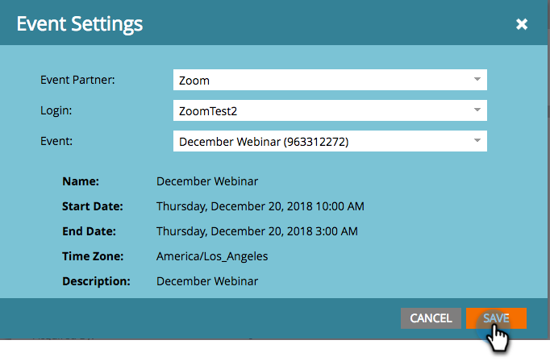

# 使用縮放建立事件 {#create-an-event-with-zoom}

>[!PREREQUISITES]
>
>* [將縮放新增為LaunchPoint服務](/help/marketo/product-docs/administration/additional-integrations/add-zoom-as-a-launchpoint-service.md)
>* [建立新事件方案](/help/marketo/product-docs/demand-generation/events/understanding-events/create-a-new-event-program.md)
>* 設定適當 [流量動作](/help/marketo/product-docs/core-marketo-concepts/smart-campaigns/flow-actions/add-a-flow-step-to-a-smart-campaign.md)追蹤參與

首先，以縮放建立您的網路研討會。 Marketo會使用建立縮放時的某些設定，而有些僅供縮放使用。

在您建立Marketo活動並建立縮放網路研討會的關聯後，系統將能夠共用註冊和考勤資訊。 如需建立網路研討會的協助，請參閱  [縮放快速入門網路研討會](https://support.zoom.us/hc/en-us/articles/200917029-Getting-Started-With-Webinar).

為您的網路研討會輸入下列資訊，這些資訊將透過轉接程式提取至Marketo。 若您對此資訊進行任何變更，您必須按一下「事件動作」下方的「從網路研討會提供者重新整理」連結，Marketo才能查看變更。

**標題和說明**

* **網路研討會名稱**  — 輸入網路研討會的名稱。 您可在Marketo中檢視此名稱。

* **說明** （可選） — 輸入網路研討會的說明。 您可在Marketo中檢視說明。

**日期和時間**

* **開始日期**  — 輸入您的開始日期。 您可在Marketo中檢視此內容。

* **開始時間**  — 輸入您的開始時間。 您可在Marketo中檢視此內容。

* **持續時間**  — 輸入持續時間。 您可在Marketo中檢視開始時間和結束時間。

* **時區**  — 選取適用的時區。 您可在Marketo中檢視此內容。

* **循環網路研討會** — 保持未選中狀態。

* **註冊**  — 選中此框以要求註冊。 您將使用Marketo表單/登錄頁面來擷取要推送至縮放的註冊資訊。

>[!NOTE]
>
>Marketo目前不支援循環網路研討會。 您必須在每個Marketo活動與縮放網路研討會之間設定單一工作階段。

>[!TIP]
>
>您將在縮放中設定其他欄位，這些欄位不會影響整合。 請參閱 [縮放網路研討會說明中心](https://support.zoom.us/hc/en-us/sections/200324965-Video-Webinar) 以取得這些欄位的其他資訊。

現在，讓我們跳進Marketo!

1. 選取事件。 按一下 **事件動作** 選擇 **事件設定**.

   

   >[!NOTE]
   >
   >選取事件的通道類型必須 **網路研討會**.

1. 選擇 **縮放** 從 **事件** **合作夥伴** 清單。

   

1. 選擇要關聯事件的縮放帳戶。

   

1. 選取網路研討會。

   

1. 按一下 **儲存**.

   

   太棒了！ 現在，事件已由縮放同步和排程。

   >[!NOTE]
   >
   >Marketo傳送的欄位包括：名字，姓氏，電子郵件地址。

   >[!TIP]
   >
   >若要將此唯一URL填入確認電子郵件，請在電子郵件中使用下列代號： `{{member.webinar url}}`. 當確認URL傳出時，此Token會自動解析為人員的唯一確認URL。
   >
   >將您的確認電子郵件設定為 **操作** 確保註冊和可能被取消訂閱的人仍然收到其確認資訊。

   註冊參加網路研討會的人，會透過 **更改程式狀態** 新狀態設為「已註冊」時的流程步驟。 沒有其他狀態會將該人員推過。 另外，請務必確認 **更改程式狀態** 流步驟#1和 **傳送電子郵件** 流程步驟#2。

   

   >[!CAUTION]
   >
   >避免使用巢狀電子郵件程式來傳送確認電子郵件。 請改用事件方案的智慧型行銷活動，如上所示。

   >[!TIP]
   >
   >資料最多可能需要48小時才會顯示在Marketo中。 如果等了那麼長的時間後，您仍然看不到任何內容，請選取 **從網路研討會提供者重新整理** ，從 **摘要** 標籤。
