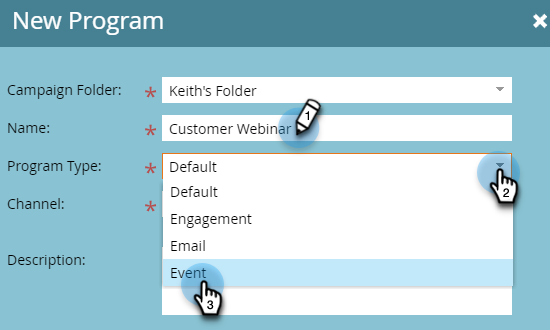

# 建立互動式網路研討會 {#create-an-interactive-webinar}

透過幾個簡單的步驟建立互動式網路研討會。

1. 前往 **行銷活動**.

   

1. 以滑鼠右鍵按一下所需的資料夾，然後選取 **新計畫**.

   

1. 為方案命名。 在方案類型下，選擇 **事件**.

   

1. 按一下「管道」下拉式清單，然後選取 **網路研討會**.

   

1. 選擇 **互動式網路研討會** 按一下 **下一個**.

   

   >[!NOTE]
   >
   >合作夥伴網路研討會的資訊可在此處找到。

1. 設定您網路研討會的最大受眾規模及其持續時間。

   

1. 排程網路研討會的日期/時間，然後按一下 **建立**.

   

您的互動式網路研討會已建立。 現在該 [設計](/help/marketo/product-docs/demand-generation/events/interactive-webinars/designing-interactive-webinars.md).

