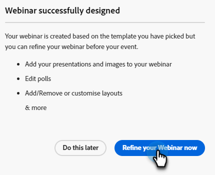

# 設計互動式網路研討會 {#designing-interactive-webinars}

瞭解如何設計適合您需求的網路研討會。

1. 選擇您的事件，然後按一下 **設計網路研討會**。

   

1. 您可以選擇現有網路研討會檔案室或建立新檔案室。 在此示例中，我們正在建立新的示例，因此按一下 **選擇檔案室** 下拉並選擇 **新的互動式網路研討會室**。

   

   >[!NOTE]
   >
   >會議室是用於進行會議的線上空間。

1. 選擇模板。

   

1. 您的網路研討會預覽將出現。

   

1. 可以選擇不同的佈局進行預覽。 要繼續，請按一下 **使用模板**。

   

1. 您可以立即或稍後改進網路研討會。 現在就開始吧。 按一下 **立即優化網路研討會**。

   

1. 選擇音頻/視頻首選項並按一下 **進入檔案室**。

   

1. 您選擇的模板現在可編輯。

   

1. 有關會議室和模板的詳細資訊，請查看「會議室模板和佈局」部分 [此Adobe幫助文章](https://helpx.adobe.com/in/adobe-connect/using/creating-arranging-meetings.html#creating_and_arranging_meetings){target="_blank"}。

1. 設計完網路研討會後，按一下 **退出檔案室**。

   

## 設計元素 {#design-elements}

**模板**:根據正在交付的網路研討會目標向房間提供的結構。 例如，如果您想安排產品展示網路研討會，螢幕共用將是展示演示的一個重要元件。 該模板確保在配置網路研討會室期間，有效交付特定類型的網路研討會所需的基本元件就位。

**佈局**:指確保網路研討會成功所需的多個元件以特定模板進行安排的各種方式。 單個模板可以具有多個佈局供您選擇。 網路研討會的基本元件在模板之間將保持不變。 您選擇的安排最適合您或提供網路研討會的演示者的風格/需要。

**莢**:在網路研討會期間執行特定活動的模板內的元件。 例如，設定並傳送輪詢，以捕獲一個活動中可通過輪詢程式完成的參與者的響應。 同樣，與參與者聊天以傳遞資訊或與他們隨意交互可以是通過聊天盒傳遞的活動。 還有多個其它資料夾，如共用、注釋、視頻、聊天、與會者清單、檔案、Web連結、輪詢和問答。
