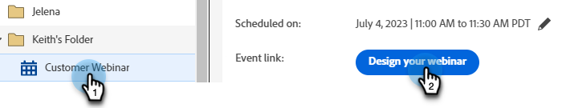

# 設計互動式網路研討會 {#designing-interactive-webinars}

根據您的喜好設計您的網路研討會。

1. 選取您的事件，然後按一下 **設計網路研討會**.

   

1. 您可以選擇現有的網路研討會室或建立新的網路研討會室。 在此範例中，我們要建立新的，因此按一下 **選擇檔案室** 下拉式清單和選擇 **全新互動網路研討會室**.

   

   >[!NOTE]
   >
   >房間是用來舉行會議的線上空間。

1. 選擇範本。

   

1. 您的網路研討會預覽將會顯示。

   

1. 您可以選取不同的版面來預覽。 若要繼續，請按一下 **使用範本**.

   

1. 您可以立即或稍後改進網路研討會。 現在就開始吧。 按一下 **立即調整網路研討會**.

   

1. 選取您的音訊/視訊偏好設定，然後按一下 **進入房間**.

   

1. 您選取的範本現在可以編輯。

   

1. 有關會議室和模板的詳細資訊，請查看 [本Adobe說明文章](https://helpx.adobe.com/in/adobe-connect/using/creating-arranging-meetings.html#creating_and_arranging_meetings){target="_blank"}.

1. 完成網路研討會的設計時，請按一下 **退出室**.

   

## 設計元素 {#design-elements}

**範本**:範本是根據要傳送的網路研討會目標，提供給會議室的結構。 例如，如果您想要排程產品展示網路研討會，螢幕共用是展示示範的必要元件。 此範本可確保在設定網路研討會室期間，有效交付特定類型的網路研討會所需的基本元件已就緒。

**版面**:版面配置是指將多個必要元件排列在特定範本中，以確保網路研討會成功的各種方式。 單一範本可以有多個版面供您選擇。 網路研討會的基本元件在各範本內維持不變。 您選擇的安排最適合您或提供網路研討會的演示者的風格/需求。

**Pod**:Pod是指範本內的元件，可在網路研討會期間執行特定活動。 例如，設定和傳送民調問答，以擷取一個活動中參與者的回應，而該活動可由民調問答Pod履行。 同樣，與參與者聊天以傳達訊息或與其隨意互動，可能是透過聊天窗格傳送的活動。 還有多個其他Pod可用，例如共用、備注、視頻、聊天、與會者清單、檔案、Web連結、民調問答以及問答。
