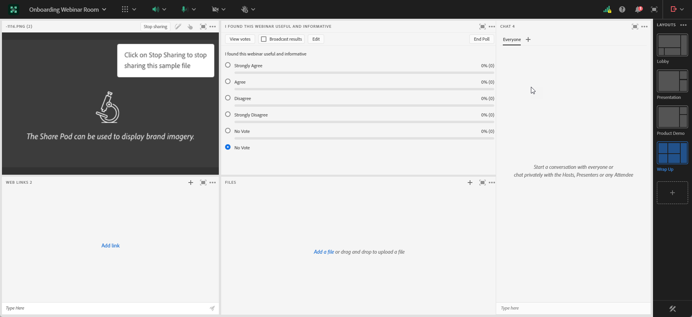

# 設計互動式網路研討會 {#designing-interactive-webinars}

簡介。

1. 選取您的事件，然後按一下 **設計網路研討會**.

   

1. 您可以選擇現有的網路研討會室或建立新的網路研討會室。 在此範例中，我們要建立新的，因此按一下 **選擇檔案室** 下拉式清單和選擇 **全新互動網路研討會室**.

   

   >[!NOTE]
   >
   >房間是一個線上空間，你將用來舉行會議。

1. 選擇範本。

   

1. 您的網路研討會預覽將會顯示。

   

1. 您可以選取不同的版面來預覽。 若要繼續，請按一下 **使用範本**.

   

1. 您可以立即或稍後改進網路研討會。 現在就開始吧。 按一下 **立即調整網路研討會**.

   

1. 選取您的音訊/視訊偏好設定，然後按一下 **進入房間**.

   

1. 您選取的範本現在可以編輯。

   

1. 文字

https://helpx.adobe.com/in/adobe-connect/using/creating-arranging-meetings.html#creating_and_arranging_meetings??????

房間：（已從Connect文檔中獲取此資訊，以精確）來源：https://helpx.adobe.com/in/adobe-connect/using/meeting-basics.html

Adobe Connect網路研討會是供多名使用者參加的即時互動式線上會議。 此房間是一個永久的線上虛擬空間，您可用來舉辦網路研討會。 它包含各種顯示面板(pod)和配置。 有幾種預先構建的會議室佈局，或者您可以建立並使用其他自定義佈局來滿足您的需求。 會議室可讓與會者共用電腦螢幕或檔案、聊天、廣播音頻和視頻，並參與互動式線上活動。

範本:

範本是根據檔案室中傳送的網路研討會目標，提供給檔案室的結構。 例如，如果行銷人員想要排程產品展示網路研討會，則螢幕共用是展示示範的必要元件。 此範本可確保在設定網路研討會室期間，有效交付特定類型的網路研討會所需的基本元件已就緒。

配置：

配置是指將多個必要元件排列在特定範本中，以確保網路研討會成功的各種方式。 單一範本可有多種配置供行銷人員選擇。 網路研討會的基本元件在各範本內維持不變。 行銷人員選取的安排最適合行銷人員或傳送網路研討會的簡報者的需求和風格。

Pod:

Pod是指範本內的元件，可協助您在網路研討會期間執行特定活動。 例如，設定和傳送民調問答，以擷取一個活動中可由民調問答Pod履行的參與者回應。 同樣，與參與者聊天以傳達訊息或與他們隨意互動，也可能是透過聊天窗格傳送的活動。 「連接」中提供了多個其他Pod，如「共用」、「注釋」、「視頻」、「聊天」、「與會者清單」、「檔案」、「Web連結」、「輪詢」和「問答」。