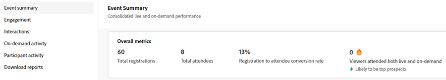
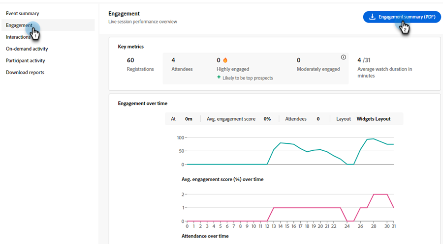

# 參與儀表板 {#engagement-dashboard}

由Adobe Connect支援的互動式網路研討會使用各種Pod，讓參與者參與聊天、問答、測驗和投票。 參與儀表板可讓您追蹤關鍵量度和資料視覺效果。

檢視事件期間參與者活動、互動及參與的整合檢視。 身為主持人，您可以檢視即時和隨選事件的效能，並在工作階段後下載各種報表。 此外，從控制面板產生的後網路研討會報告可用於評估工作階段的成效、為未來內容提供資訊，並改善整體網路研討會策略。

儀表板會追蹤各種量度，包括投票回應、聊天活動和視訊互動，為參與者的偏好和行為提供有價值的深入分析。 它提供參與者活動和參與層級的全面概觀，讓主機可監控即時出勤、參與和互動。

在互動式網路研討會中檢視下列型別工作階段的參與。

* **即時工作階段**：參與者可以主動互動的即時線上工作階段。
* **隨選工作階段**：即時活動的錄製可做為自己的活動使用。 新受邀者可以註冊並觀看錄製。 註冊之後，使用者會收到事件加入連結，在活動結束後將使用者導向至事件的錄影。 為即時活動註冊的參與者也可以使用相同的加入連結來檢視錄製。

## 檢視控制面板 {#view-the-dashboard}

1. 移至&#x200B;**[!UICONTROL 行銷活動]**。

   

1. 選取所需的已完成事件。

   

1. 在總覽中，按一下&#x200B;**[!UICONTROL 檢視參與儀表板]**。

   

   >[!NOTE]
   >
   >參與控制面板在排程事件結束後45到120分鐘內可供存取。

## 控制面板詳細資訊 {#dashboard-details}

您可以在參與控制面板中檢視下列詳細資訊。

<table><tbody>
  <tr>
    <td><b>事件摘要</td>
    <td>提供即時和隨選研討會效能的整合檢視。</td>
  </tr>
  <tr>
    <td><b>參與</td>
    <td>提供即時工作階段效能的概觀。</td>
  </tr>
  <tr>
    <td><b>互動</td>
    <td>提供參與者在各個Pod間參與情況的詳細檢視。</td>
  </tr>
  <tr>
    <td><b>隨選活動</td>
    <td>提供錄製效能的摘要。</td>
  </tr>
  <tr>
    <td><b>參與者活動</td>
    <td>提供整合的參與檢視。</td>
  </tr>
  <tr>
    <td><b>下載報表</td>
    <td>下載不同Pod中的參與報表。</td>
  </tr>
</tbody>
</table>

### 事件摘要 {#event-summary}

此介面可針對即時和隨選研討會提供事件效能的整合檢視。 從左側面板中，選取「事件摘要」以檢視整體量度。

<table><tbody>
  <tr>
    <td><b>註冊總數</td>
    <td>這會顯示註冊活動的參與者人數。</td>
  </tr>
  <tr>
    <td><b>出席者總數</td>
    <td>這會顯示參加活動的參與者人數。</td>
  </tr>
  <tr>
    <td><b>與會者註冊轉換率</td>
    <td>這會顯示註冊及參加活動的參與者百分比。</td>
  </tr>
  <tr>
    <td><b>檢視者同時參與即時和隨選課程</td>
    <td>這會顯示同時參與即時和隨選活動的參與者人數。</td>
  </tr>
</tbody>
</table>

### 參與 {#engagement}

提供活動即時工作階段績效的概觀。 此概觀包含關鍵量度、一段時間內的參與度和參與者互動。 它可協助組織者評估活動是否成功，並找出需改善的領域。

從左側面板中，選取&#x200B;**[!UICONTROL 參與]**&#x200B;以檢視即時工作階段的效能。 **[!UICONTROL 按一下參與摘要(PDF)]**&#x200B;以下載即時工作階段的效能摘要。 「概述」提供不同區段中的資料。

**關鍵量度**

檢視即時工作階段的註冊數、出席者數和參與數。

<table><tbody>
  <tr>
    <td><b>註冊</td>
    <td>檢視即時工作階段的註冊數量。</td>
  </tr>
  <tr>
    <td><b>出席者</td>
    <td>檢視即時工作階段中的參與者人數。</td>
  </tr>
  <tr>
    <td><b>高度參與</td>
    <td>檢視在即時工作階段中高度參與且可能成為熱門潛在客戶的參與者人數。</td>
  </tr>
  <tr>
    <td><b>參與中等</td>
    <td>檢視即時工作階段中適度參與的參與者人數。
     <b>注意</b>：這些數字是根據工作階段期間的參與和互動計算的。</td>
  </tr>
  <tr>
    <td><b>平均觀看持續時間（分鐘）</td>
    <td>顯示即時工作階段的平均觀看持續時間（分鐘）。</td>
  </tr>
</tbody>
</table>

**一段時間內的參與度**

從參與圖表瞭解即時工作階段期間一段時間的平均參與。 主機可監控參與程度如何波動，讓他們識別高互動或低互動的關鍵時刻。 檢視不同版面中參與參與參與者的平均參與分數有多少。

將滑鼠指標暫留在圖表上，即可檢視下列資訊：

* 監視參與程度的時間。
* 該時的平均參與分數。
* 當時參與的出席者人數。
* 當時的參與版面配置。
* 選取&#x200B;**[!UICONTROL 在錄製中檢視即時]**&#x200B;以檢視參與度高或低的錄製中的即時。
* 工作階段中一段時間的平均參與分數(%)
* 工作階段中一段時間內的出席情況
* 活動期間在聊天室中使用不同的版面時，會顯示不同網路研討會版面的參與度。 它有助於關聯不同版面中參與度的上升和下降。

**出席者互動**

您可以從不同的Pod檢視出席者的互動。 它提供已回答的投票、問題集、與聊天互動、按一下至少一個連結，以及下載至少一個檔案等資訊。

選取&#x200B;**[!UICONTROL 移至互動]**&#x200B;以檢視工作階段期間來自輪詢、QnA量度和與會者回應的回應。 從下節的「互動」和下載互動報表，檢視參與者在各個Pod的參與情形。

### 互動 {#interactions}

透過「互動」檢視出席者如何互動及參與工作階段。 追蹤對輪詢、QnA量度、出席者的回應以及相應Pod中捨棄的連結和檔案的回應。 主機也可以下載這些Pod的互動報表，以進行更佳的分析。 透過分析這些互動，您可以識別趨勢並調整其策略，以鼓勵互動性更強且更吸引人的環境。

從左側面板中選取&#x200B;**[!UICONTROL 互動]**，以檢視出席者在Pod間的參與情形。

從功能表列選取&#x200B;**[!UICONTROL 輪詢]**&#x200B;索引標籤，以檢視新增至輪詢的問題和回應。 此標籤會顯示下列資訊：

* 選取&#x200B;**[!UICONTROL 輪詢報告(CSV)]**&#x200B;以下載輪詢面板中互動的報告。
* 輪詢問題及其型別。
* 回應數，以及輪詢Pod開啟並參與的時段。
* 選取&#x200B;**檢視所有`<number>`回應**&#x200B;以在對話視窗中檢視回應。

從功能表列選取&#x200B;**[!UICONTROL 其他互動]**&#x200B;標籤，以檢視其他Pod中的參與並下載其報表。

從下拉式清單中選取&#x200B;**[!UICONTROL 下載互動報告]**，即可下載不同Pod的報告。 從這裡下載QnA報表、連結和檔案報表，以及回應報表，以獲得更好的追蹤。

不同區段提供各個Pod的參與資訊。

**QnA量度**

檢視「問答」Pod的下列屬性。

* 問題總數。
* 未回答的問題數。
* 提出問題的出席者人數。
* 詢問多個問題（可能成為熱門潛在客戶）的與會者人數。
* 回答問題所花費的平均時間。

**回應**

從這裡檢視出席者的反應，例如同意、不同意、鼓掌以及在會議期間大笑。

從反應圖形中，檢視下列詳細資訊：

* 回應總數
* 至少回應一次的出席者人數
* 點按總數
* 不重複出席者
* 根據有關不重複出席者之總點按次數的反應點按趨勢。

**網頁連結pod**

檢視在工作階段期間新增到網頁連結Pod的連結，以及共用連結的點選次數。 網路連結Pod可讓您從網路研討會以外的來源新增連結，以產生參與。

從圖表中，檢視下列詳細資訊：

* 新增至網頁連結Pod的連結。
* 至少點按一個連結的出席者人數。
* 主機啟動的連結數。
* 新增至網頁連結Pod的每個連結上的不重複點按趨勢。

**檔案pod**

檢視工作階段期間新增到檔案Pod的檔案以及不重複下載的次數。 檔案Pod可讓您新增檔案並提供資源以產生參與。

從圖表中，檢視下列詳細資訊：

* 加入檔案Pod的檔案名稱。
* 至少下載一個檔案的出席者人數。
* 每個新增至網頁連結Pod之檔案的不重複下載趨勢。

### 隨選活動 {#on-demand-activity}

從左側面板中，選取&#x200B;**[!UICONTROL 隨選活動]**&#x200B;以檢視錄製的摘要。 您也可以下載隨選活動的報表。

在隨選活動中，檢視下列量度：

* 按一下&#x200B;**[!UICONTROL 隨選報告(CSV)]**&#x200B;以下載隨選量度。
* 儀表板上次重新整理前的不重複檢視者數目。
* 檢視錄影但無法參加網路研討會的檢視者人數。
* 參加網路研討會並觀看錄影的檢視者人數。 他們可能是熱門潛在客戶。
* 註冊隨選工作階段的檢視器數目。
* 錄製作業的平均觀看持續時間（分鐘）。

### 參與者活動 {#participant-activity}

從左側面板中選取&#x200B;**[!UICONTROL 參與者活動]**，以檢視有關每位出席者參與層級的整合資訊。 檢視此參與如何從「參與者」參與層次分類至層次。 按一下&#x200B;**[!UICONTROL 使用者活動報告(CSV)]**&#x200B;以下載報告以進行更好的追蹤。

從表格中檢視下列詳細資訊：

* 每個參與者的參與層級。 您也可以將其從高到低排序，反之亦然。
* 參與者參與的工作階段期間。
* 參與者回答的投票。
* 參與者從檔案Pod下載的檔案。
* 參與者從網頁連結面板點按的連結。
* 參與者從QnA Pod提出的問題。

### 下載報表 {#download-reports}

從集中式中心作為主機下載不同活動和Pod的報表。

1. 從左側面板中，選取&#x200B;**[!UICONTROL 下載報表]**。

1. 選取&#x200B;**[!UICONTROL 全部下載(.zip)]**，一次下載所有活動和pod的報表。

   

>[!NOTE]
>
>按一下每個報表旁的下載圖示，個別進行下載。

## 參與者參與層級 {#participant-engagement-level}

組織使用Adobe Connect提供高度客製化、品牌化、參與導向的網路研討會。 投票、聊天、問答和回應等互動工具有助於吸引出席者，並收集不僅僅是註冊和出席資料。 在與會者參與這些互動功能後，參與資料就會將與會者分類為三個參與層級：高、中及低。 您可以使用參與層級來更新對象區段、更新人員分數及警示銷售。

瞭解為每個參與者分類參與層級的條件：

<table><thead>
  <tr>
    <th>參與層級</th>
    <th>分類條件</th>
  </tr></thead>
<tbody>
  <tr>
    <td>高</td>
    <td>符合下列所有條件的參與者：
    <li>出席期間至少佔總事件時間的80%。</li>
    <li>所有的多重選擇問題(MCQ)和多重回答(MA)投票都會得到回答，至少會下載一個檔案，或者張貼的聊天次數是五個或更多。</li>
    <li>出席者已在Q&amp;A Pod中提出至少一個問題。</li></td>
  </tr>
  <tr>
    <td>媒體</td>
    <td>符合下列所有條件的參與者：
    <li>出席者的參與層級並未判定為高。</li>
    <li>出席期間至少佔總事件時間的60%。</li>
    <li>出席者已執行下列至少一項動作：
    <ul>
    <li>已回答至少一個投票。
    <li>在Q&amp;A Pod中至少詢問了一個問題。<li>已下載至少一個檔案。
    <li>已按一下（但未啟動）至少一個網頁連結。<li>張貼了三個或更多聊天。</ul></li>
    </td>
  </tr>
  <tr>
    <td>低</td>
    <td>未分類為高或中等的所有參與者。</td>
  </tr>
</tbody></table>
