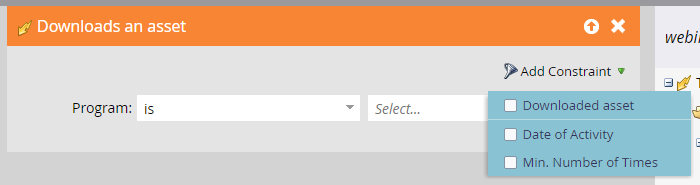

# 事件工作流 {#event-workflows}

在網路研討會完成後，轉到「儀表板」頁籤查看聚合效能。

>[!NOTE]
>
>如果網路研討會尚未完成或由於任何原因未收到資料，則「儀表板」頁籤將不可用。

## 儀表板小部件 {#dashboard-widgets}

儀表板由四個小部件組成。

**事件程式狀態**:顯示該事件的各種程式狀態以及當前持有該程式狀態值的程式的成員數。

**出席率**:重點介紹參加網路研討會的不同成員的出席時間，與整體網路研討會的出席時間（以百分比計）相比。

**輪詢效能**:顯示在Adobe Connect網路研討會期間啟動的各種民調，以及參加並對每個答案回答的投票成員的分佈。

**按一下並檔案下載活動**:提供參加網路研討會並採取特定行動的各成員在Adobe Connect網路研討會期間按一下的檔案和網路連結的下載計數。

## 觸發器和篩選器 {#triggers-and-filters}

使用與互動式網路研討會相關的觸發器和篩選器來查找您的活動計畫中的特定人員組。

每個觸發器/過濾器都附加了附加約束，允許您捕獲該組的集中子集。

**在事件期間提問** (篩選器版本：在活動期間問過問題)

**參加活動** (篩選器版本：已參加活動)

**按一下連結** (篩選器版本：已按一下連結)

**下載資產** (篩選器版本：已下載資產)

**響應輪詢** (篩選器版本：已響應輪詢)

