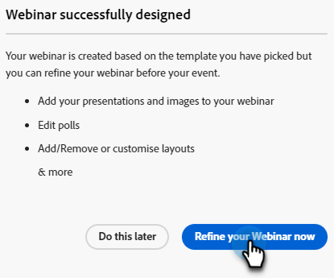

# 修改或刪除互動式網路研討會 {#modify-or-delete-an-interactive-webinar}

瞭解如何變更您的互動式網路研討會。

## 修改互動式網路研討會 {#modify-an-interactive-webinar}

1. 選取所需的事件計畫並按一下 **變更會議室/範本**.

   

1. 房間將會載入。 如果要變更檔案室，請從「檔案室」下拉式清單中選取一個檔案室。 若要只更新範本，請按一下 **使用空間**.

   

>[!NOTE]
>
>變更您的檔案室是選擇性的，不需要更新您的範本。

1. 按一下 **立即調整您的網路研討會**.

   

1. 選取您的音訊/視訊偏好設定，然後按一下 **進入房間**.

   

1. 完成修改後，按一下「 」 **退出房間**.

   

## 重新排程互動式網路研討會 {#reschedule-an-interactive-webinar}

1. 選取所需的事件計畫，然後按一下目前排程日期/時間旁的鉛筆圖示。

   

1. 按一下日曆圖示，選擇新的日期/時間，然後按一下 **儲存**.

   

## 複製互動式網路研討會 {#clone-an-interactive-webinar}

1. 選取所需的事件程式。

   

1. 按一下程式動作下拉式清單，然後選取 **原地複製**.

   

   >[!TIP]
   >
   >您也可以以滑鼠右鍵按一下樹狀結構中的「事件程式」，然後選取 **原地複製** 從那裡。

1. 為複製的計畫命名、設定工作區和目的地（如果您希望計畫在其他地方存放），然後按一下 **儲存**.

   

1. 按一下 **下一個**.

   

   >[!NOTE]
   >
   >目前您只能將複製的互動式網路研討會儲存為互動式網路研討會。 將複製的網路研討會儲存為合作夥伴網路研討會（例如Zoom、ON24等） 即將推出。

1. 選擇複製網路研討會的設定，然後按一下 **原地複製**.

   

## 刪除互動式網路研討會 {#delete-an-interactive-webinar}

1. 選取所需的事件程式。

   

1. 按一下程式動作下拉式清單，然後選取 **刪除**.

   

   >[!TIP]
   >
   >您也可以以滑鼠右鍵按一下樹狀結構中的「事件程式」，然後選取 **刪除** 從那裡。

1. 按一下 **刪除**.

   

   >[!IMPORTANT]
   >
   >如果程式中有任何本機資產，這些資產也會一併刪除。
