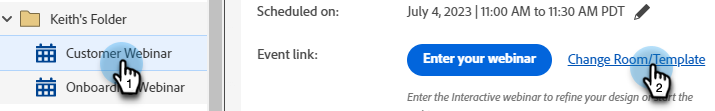

# 修改或刪除互動式網路研討會 {#modify-or-delete-an-interactive-webinar}

了解如何變更您的互動式網路研討會。

## 修改互動式網路研討會 {#modify-an-interactive-webinar}

1. 選取所需的事件方案，然後按一下 **更改檔案室/模板**.

   

1. 文字

PICC

???對於Nilesh — 不被帶到網路研討會已在的房間是正常的嗎？ 如果沒有，最佳實務是什麼？

## 重新排程互動式網路研討會 {#reschedule-an-interactive-webinar}

1. 選取所需的「事件方案」，然後按一下目前排程日期/時間旁的鉛筆圖示。

   

1. 按一下日曆圖示，選擇新的日期/時間，然後按一下 **儲存**.

   

## 複製互動式網路研討會 {#clone-an-interactive-webinar}

1. 選擇所需的事件方案。

   

1. 按一下「Program Actions（程式操作）」下拉清單，然後選擇 **原地複製**.

   

   >[!TIP]
   >
   >也可以按一下右鍵樹中的「Event Program（事件程式）」 ，然後選擇 **原地複製** 從那裡。

1. 為複製的程式命名、設定工作區和目的地（如果您希望程式存留在其他位置），然後按一下 **儲存**.

   

1. 按一下 **下一個**.

   

1. 選擇您複製的網路研討會的設定，然後按一下 **原地複製**.

   

## 刪除互動式網路研討會 {#delete-an-interactive-webinar}

1. 選擇所需的事件方案。

   

1. 按一下「Program Actions（程式操作）」下拉清單，然後選擇 **刪除**.

   

   >[!TIP]
   >
   >也可以按一下右鍵樹中的「Event Program（事件程式）」 ，然後選擇 **刪除** 從那裡。

1. 按一下 **刪除**.

   

   >[!IMPORTANT]
   >
   >如果程式中有任何本機資產，也會刪除這些資產。
