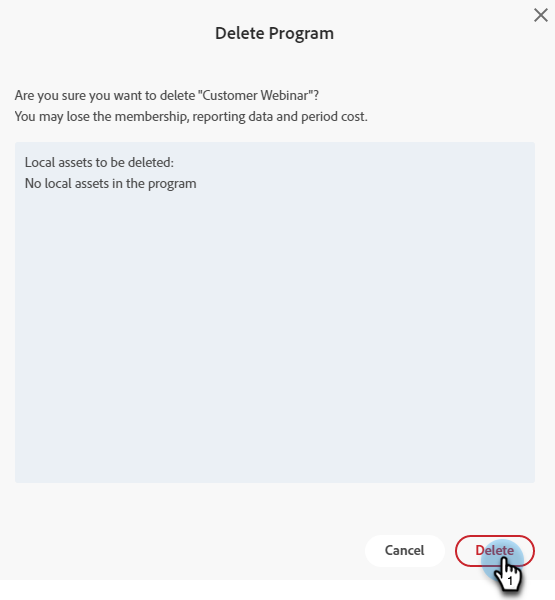

# 修改或刪除互動式網路研討會 {#modify-or-delete-an-interactive-webinar}

瞭解如何更改您的互動式網路研討會。

## 修改互動式網路研討會 {#modify-an-interactive-webinar}

1. 選擇所需的事件程式，然後按一下 **更改檔案室/模板**。

   

1. 房間會裝貨的。 如果要更改檔案室，請從「檔案室」下拉清單中選擇一個檔案室。 要僅更新模板，請按一下 **使用室**。

   

>[!NOTE]
>
>更改檔案室是可選的，不需要更新模板。

1. 按一下 **立即優化網路研討會**。

   

1. 選擇音頻/視頻首選項並按一下 **進入檔案室**。

   

1. 完成修改後，按一下 **退出檔案室**。

   

## 重新安排互動式網路研討會 {#reschedule-an-interactive-webinar}

1. 選擇所需的事件程式，然後按一下當前計畫日期/時間旁邊的鉛筆表徵圖。

   

1. 按一下日曆表徵圖，選擇新日期/時間，然後按一下 **保存**。

   

## 克隆互動式網路研討會 {#clone-an-interactive-webinar}

1. 選擇所需的事件程式。

   

1. 按一下「程式操作」(Program Actions)下拉框並選擇 **克隆**。

   

   >[!TIP]
   >
   >也可以按一下右鍵樹中的「事件程式」並選擇 **克隆** 從那兒。

1. 為克隆的程式指定名稱，設定工作區和目標（如果希望該程式在其他位置運行），然後按一下 **保存**。

   

1. 按一下 **下一個**。

   

   >[!NOTE]
   >
   >此時，您只能將克隆的互動式網路研討會另存為互動式網路研討會。 將克隆的網路研討會保存為合作夥伴網路研討會（例如，Zoom、ON24等） 很快就可以了。

1. 選擇克隆網路研討會的設定，然後按一下 **克隆**。

   

## 刪除互動式網路研討會 {#delete-an-interactive-webinar}

1. 選擇所需的事件程式。

   

1. 按一下「程式操作」(Program Actions)下拉框並選擇 **刪除**。

   

   >[!TIP]
   >
   >也可以按一下右鍵樹中的「事件程式」並選擇 **刪除** 從那兒。

1. 按一下 **刪除**。

   

   >[!IMPORTANT]
   >
   >如果程式中存在任何本地資產，則也會刪除這些資產。
