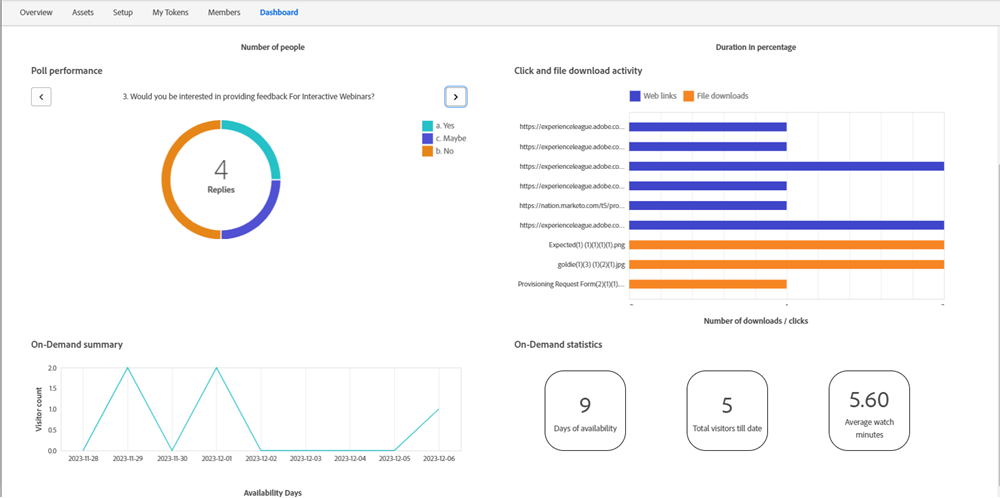

# 隨選網路研討會 {#on-demand-webinars}

隨選網路研討會會擷取並調整已註冊但未參加活動的潛在客戶，但您想要透過觀看錄影來取得與活動相關的資訊。 名稱、電子郵件ID和觀看日期/持續時間等資訊可在Marketo Engage中擷取，並用於鎖定這些不顯示的潛在客戶。

在活動之前與註冊者共用的網路研討會加入URL可用於觀看隨選錄製。 一旦註冊者未參加即時活動（例如，方案狀態為「不顯示」的潛在客戶），按一下網路研討會加入URL，該潛在客戶的方案狀態將從「不顯示」變更為「已出席的隨選」。 如果他們決定造訪加入URL並觀看隨選錄製，則觀看活動直播且狀態為「已參加」的潛在客戶的方案狀態不受影響。

Adobe Connect這項支援互動式網路研討會的技術，會追蹤瀏覽以及與觀看錄影的潛在客戶相關的觀看持續時間，並每日向Marketo Engage報告資訊。 對隨選網路研討會的追蹤會在事件發生30天後停止。 無法修改持續時間。

Marketo Engage在以下Widget的協助下，提供「儀表板」標籤上隨選網路研討會的觀看統計資料：

* 隨選摘要：提供在指定日期事件後觀看錄影的訪客計數（不顯示）摘要

* 隨選統計：此Widget提供下列資訊：
   * 隨選錄製可供檢視的天數 — 協助行銷人員執行動作，例如在臨近錄製可用期間30天的結尾處執行電子郵件行銷活動。
   * 目前為止的隨選網路研討會訪客總數 — 目前為止觀看隨選錄影的所有不播報註冊者人數。
   * 所有訪客的平均觀看持續時間（以分鐘為單位） — 可讓行銷人員瞭解已檢視的錄製內容量，以及可以使用哪些Smart Campaigns來鎖定超過特定觀看持續時間的銷售機會。

>[!NOTE]
>
>觀看持續時間超過一分鐘時才會計入檢視。

互動式網路研討會的篩選器和觸發器已經過修改，以符合隨選網路研討會的需求。 觸發器「出席事件」和篩選器「已出席事件」新增了附加限制（「事件模式」），行銷人員可選擇目標為「即時」或「隨選」對象。 如果未選取「事件模式」限制，即會鎖定即時和隨選受眾。 其他限制（例如「觀看日期」和「觀看持續時間」）可搭配「隨選」事件模式使用。 非使用狀態篩選器「尚未出席活動」也可用於具有「隨選」事件模式的隨選網路研討會。
