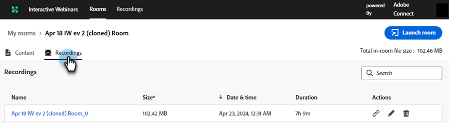

# 房間管理 {#room-management}

由Adobe Connect提供支援的互動式網路研討會室，旨在促進互動式及合作式線上活動。 這些網路研討會會儲存網路研討會期間建立和使用的內容和錄影。 作為擁有建立檔案室許可權的成員，您可以從中央位置存取及管理檔案室。

>[!NOTE]
>
>您只能存取您為網路研討會建立的會議室，而無法存取貴組織中其他成員的會議室。

## 管理和存取會議室與錄製 {#manage-and-access-rooms-and-recordings}

1. 移至&#x200B;**[!UICONTROL 設計工作室]**。

   

1. 選取&#x200B;**[!UICONTROL 互動式網路研討會]**，然後選取&#x200B;**[!UICONTROL 管理會議室]**。

   

### 會議室 {#rooms}

互動式網路研討會室是虛擬空間，專為舉辦即時、吸引人的線上活動而設計，參與者可在此與簡報者和其他參與者互動。 在這些會議室，您可以找到網路研討會中的上傳內容和錄影。

若要檢視所有會議室的清單，請從上方功能表列選取&#x200B;**[!UICONTROL 會議室]**。 您可以在這些聊天室中找到您建立的所有聊天室，以及上傳的內容和錄製。 您也可以檢視錄製數量、室內檔案大小，以及個別室內上次存取日期。

<table><tbody>
  <tr>
    <td><b>錄製</td>
    <td>檢視聊天室中可用的錄製數量。</td>
  </tr>
  <tr>
    <td><b>室內檔案大小</td>
    <td>檢視會議室中可用的內容和錄製的合併檔案大小。</td>
  </tr>
  <tr>
    <td><b>上次存取日期</td>
    <td>顯示上次存取檔案室的日期。 您可以根據時間表來排序資訊。</td>
  </tr>
</tbody>
</table>

您可以從此集中式介面執行下列動作：

* 按一下「啟動檔案室」圖示以啟動並進入檔案室。
* 使用搜尋列來尋找您要的會議室（只會搜尋您建立的會議室）。
* 按一下「刪除空間」圖示以移除空間。 這樣做會刪除與聊天室相關的所有錄製和檔案。

選取檔案室時，您可以檢視該檔案室中可用的內容或錄製。 在此熒幕上，資訊可在兩個索引標籤中使用： **Content**&#x200B;索引標籤和&#x200B;**Recordings**&#x200B;索引標籤。

**內容標籤**

「內容」索引標籤可讓您檢視已上傳的檔案、其型別、大小、上次存取日期和上傳日期。

<table><tbody>
  <tr>
    <td><b>類型</td>
    <td>顯示PDF、JPG、PNG等檔案型別。</td>
  </tr>
  <tr>
    <td><b>大小</td>
    <td>檢視可用檔案的大小。</td>
  </tr>
  <tr>
    <td><b>上次存取日期</td>
    <td>顯示上次存取檔案室的日期。 您可以根據時間表來排序資訊。</td>
  </tr>
  <tr>
    <td><b>已上傳</td>
    <td>顯示檔案上傳的時間。</td>
  </tr>
</tbody>
</table>

您可以在「內容」標籤中執行下列動作：

* 按一下&#x200B;**[!UICONTROL 啟動會議室]**&#x200B;按鈕以啟動並進入會議室。
* 使用搜尋列來尋找您要的檔案。
* 按一下「下載檔案」圖示，將檔案下載到裝置上。 選取要大量下載的兩個或多個檔案。
* 按一下「刪除空間」圖示以移除空間。 刪除檔案時，無法擷取該檔案。
* 從列出的內容中選取任何檔案，以在裝置上檢視該檔案。

**錄製標籤**

「錄製」索引標籤可讓您檢視此會議室中可用的所有錄製。 每個錄製都會顯示其大小、錄製日期和時間、以及持續時間等詳細資訊。

您可以從此集中式中心執行以下動作：

* 按一下&#x200B;**[!UICONTROL 啟動會議室]**&#x200B;按鈕以啟動並進入會議室。
* 使用搜尋列來尋找您要的錄製。
* 按一下「下載檔案」圖示，將檔案下載到裝置上。 選取要大量下載的兩個或多個檔案。
* 按一下「複製錄製」連結圖示以複製錄製URL。
* 按一下「編輯錄製」圖示以變更您的錄製。
* 按一下「刪除」圖示以移除錄製。 刪除錄製作業時，將無法擷取錄製作業。
* 選取要在裝置上播放的錄製。

## 管理和存取錄製 {#manage-and-access-recordings}

錄製是寶貴的資源，擷取了即時討論、簡報和問答環節的精髓。 它們可讓參與者按照自己的步調，重新造訪重要的深入分析、遺漏的詳細資訊或複雜的概念。

按一下&#x200B;**[!UICONTROL 錄製]**&#x200B;索引標籤，檢視您已上傳之所有錄製的清單。

在「**[!UICONTROL 我的錄製]**」下，您可以找到在您建立的聊天室中的所有錄製。 您也可以檢視其各自的大小、日期和時間，以及錄製的持續時間。

您可以從此集中式中心執行以下動作：

* 使用搜尋列來尋找您要的錄製。 您也可以透過選取日期範圍在時間軸內搜尋。
* 按一下「複製錄製」連結圖示以複製錄製URL。
* 按一下「編輯錄製」圖示以變更您的錄製。
* 按一下「顯示連結的頁面」圖示，即可檢視所選錄製所在空間的相關資訊。
* 按一下「刪除」圖示以移除錄製。 刪除錄製作業時，將無法擷取錄製作業。
* 選取要在裝置上播放的錄製。
