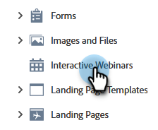

# 互動式網路研討會範本 {#templates-for-interactive-webinars}

在互動式網路研討會中建立易於使用的範本，以便在團隊中工作時更快製作內容並符合品牌准則。

## 授予許可權 {#grant-permissions}

在您組織中的任何使用者能夠存取您的互動式網路研討會範本之前，Marketo Engage管理員必須先將存取權新增至所需的角色。

1. 在Marketo Engage中，按一下&#x200B;**[!UICONTROL 管理員]**。

   

1. 按一下「**[!UICONTROL 使用者與角色]**」，然後按一下「**[!UICONTROL 角色]**」標籤。

   

1. 連按兩下您要新增許可權的角色。

   

1. 按一下以開啟&#x200B;**[!UICONTROL Access Design Studio]**。

   

1. 選取&#x200B;**[!UICONTROL 存取互動式網路研討會範本]**&#x200B;核取方塊。

   

## 建立範本 {#create-a-template}

1. 在Marketo Engage中，按一下&#x200B;**[!UICONTROL Design Studio]**。

   

1. 按一下&#x200B;**[!UICONTROL 互動式網路研討會]**。

   

1. 按一下&#x200B;**[!UICONTROL 管理範本]**。

   

1. 新標籤隨即開啟。 按一下&#x200B;**新建**。

   

1. 在[標準範本]索引標籤中，選取所需的範本，然後按一下[下一步] ****。

   

   >[!NOTE]
   >
   >組織範本是您或您的團隊已建立的範本。

1. 輸入名稱和說明。 按一下&#x200B;**儲存並開啟**。

   

1. 新標籤隨即開啟。 若要編輯/儲存範本，您必須進入檔案室。 由於這不是實際的網路研討會室，因此不需要選取音訊/視訊。 按一下&#x200B;**進入會議室**。

   

1. 對現有範本進行任何需要的變更。

   

1. 在右上角的[結束]功能表中，選取&#x200B;**全部結束工作階段**。

   

1. 按一下&#x200B;**立即結束**。

   

您的範本會自動儲存。

## 編輯範本 {#edit-a-template}

請依照下列步驟編輯現有範本。

1. 在Marketo Engage中，按一下&#x200B;**[!UICONTROL Design Studio]**。

   

1. 按一下&#x200B;**[!UICONTROL 互動式網路研討會]**。

   

1. 按一下&#x200B;**[!UICONTROL 管理範本]**。

   

1. 新標籤隨即開啟。 找到您要編輯的範本，然後按一下開啟圖示。

   

1. 新標籤隨即開啟。 若要編輯範本，您必須進入檔案室。 由於這不是實際的網路研討會室，因此不需要選取音訊/視訊。 按一下&#x200B;**進入會議室**。

   

1. 對範本進行所需的變更。

   

1. 在右上角的[結束]功能表中，選取&#x200B;**全部結束工作階段**。

   

1. 按一下&#x200B;**立即結束**。

   

您的變更會自動儲存。
