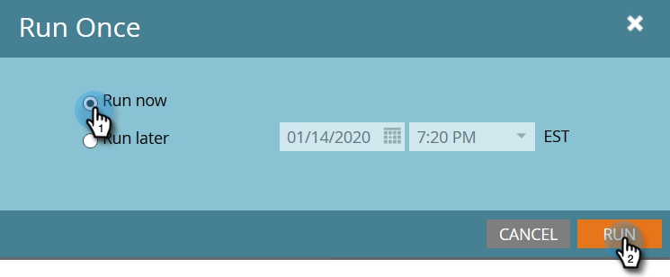

# 新增成員至事件程式 {#adding-members-to-an-event-program}

本文僅適用於使用事件上限或事件目標的使用者。

>[!CAUTION]
>
>將人員清單直接匯入事件計畫時，這些記錄將無法計算在「目標追蹤」報表和「事件上限進度」報表中的實際註冊中。 請依照下列指示操作，以確保計算您的記錄。

1. 建立和 [將人員新增至靜態清單](/help/marketo/product-docs/core-marketo-concepts/smart-lists-and-static-lists/static-lists/create-a-static-list.md).

1. [建立智慧型行銷活動](/help/marketo/product-docs/core-marketo-concepts/smart-campaigns/creating-a-smart-campaign/create-a-new-smart-campaign.md).

1. 在您於步驟二建立的Smart Campaign的「智慧列示」中，尋找並新增 **清單成員** 篩選。

   

1. 尋找並選取您在步驟1中建立的清單。

   

1. 在流量中，尋找並新增 **變更計畫狀態** 流程步驟。

   

1. 尋找並選取您的活動計畫。

   

1. 選擇您想要的狀態。

   

1. 在「排程」標籤中，按一下 **執行一次**.

   

1. 選取 **立即執行** 並按一下 **執行**.

   

1. 智慧型行銷活動執行後，成員會新增至方案，並將計入目標追蹤和事件上限進展計算中。
