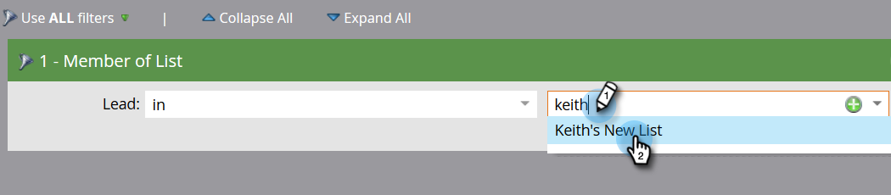

# 向事件程式{#adding-members-to-an-event-program}添加成員

本文僅適用於使用「事件上限」或「事件目標」的使用者。

>[!CAUTION]
>
>將人員清單直接匯入「事件程式」，將無法將這些記錄計入「目標追蹤」報表和「事件上限進展」報表中的實際註冊。 請依照下列指示，確保記錄已計入。

1. 建立並[將人員添加到靜態清單](/help/marketo/product-docs/core-marketo-concepts/smart-lists-and-static-lists/static-lists/create-a-static-list.md)。

1. [建立智慧型促銷活動](/help/marketo/product-docs/core-marketo-concepts/smart-campaigns/creating-a-smart-campaign/create-a-new-smart-campaign.md)。

1. 在您在步驟2中建立的智慧型促銷活動的智慧型清單中，尋找並新增&#x200B;**清單成員**&#x200B;篩選。

   

1. 尋找並選取您在步驟一中建立的清單。

   

1. 在流中，查找並添加&#x200B;**更改程式狀態**&#x200B;流步驟。

   

1. 尋找並選取您的活動計畫。

   

1. 選擇您想要的狀態。

   

1. 在「排程」標籤中，按一下「執行一次」。****

   

1. 選擇&#x200B;**立即運行**&#x200B;並按一下&#x200B;**運行**。

   

1. 在智慧型促銷活動執行後，會員會新增至程式，並將計入「目標追蹤」和「事件上限進度」計算。
