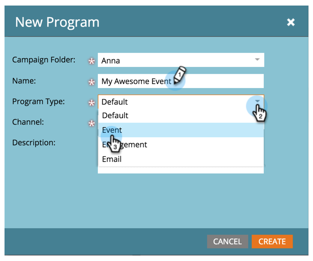
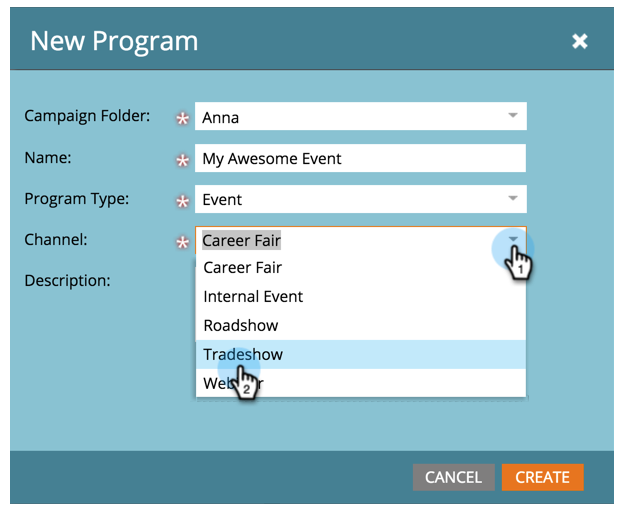
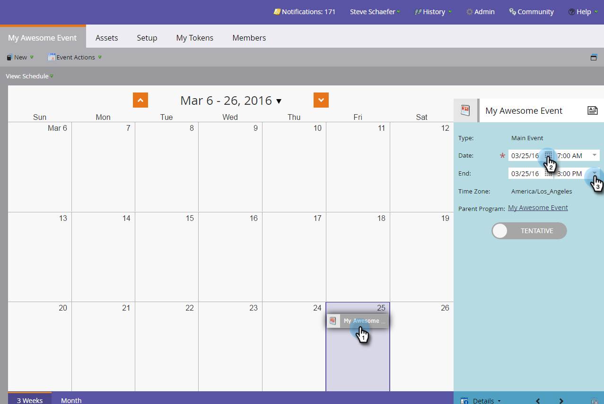

# 建立新的事件程式 {#create-a-new-event-program}

事件可讓您自動執行線上和離線事件！ 擷取您的人員在不同階段進展時的狀態，並取得行銷方案ROI的準確測量。

1. 前往 **行銷活動**.

   

1. 選取新方案的資料夾。 選取 **新增** 並按一下 **新計畫**.

   

1. 選擇事件的名稱。 然後，在下 **計畫型別**，選取 **事件**.

   

1. 選取 **頻道**.

   >[!NOTE]
   >
   >管道定義個人在方案中可擁有的不同狀態。 進一步瞭解 [計畫會籍](/help/marketo/product-docs/core-marketo-concepts/programs/creating-programs/understanding-program-membership.md) 此處。

   

1. 按一下 **建立**。

   

   太棒了！ 您的新事件現在會出現在樹狀結構中。

   

1. 若要排程您的活動，請選取 **排程檢視** 並按一下日曆中的以開啟快顯視窗。 輸入日期和時間。

   

1. 將列滑動至 **已確認** 完成時。

   

建立事件後，請建置 [登陸頁面](/help/marketo/product-docs/demand-generation/landing-pages/free-form-landing-pages/create-a-free-form-landing-page.md)， [表單](/help/marketo/product-docs/demand-generation/forms/creating-a-form/create-a-form.md)、和 [電子郵件](/help/marketo/product-docs/email-marketing/email-programs/creating-an-email-program/create-an-email-program.md) 邀請您的來賓！ 您還需要熟悉 [方案排程檢視](https://docs.marketo.com/display/docs/program+schedule+view).

>[!MORELIKETHIS]
>
>* [行銷行事曆](/help/marketo/product-docs/core-marketo-concepts/marketing-calendar/understanding-the-calendar/navigating-the-marketing-calendar.md)
>* [在程式中使用期間成本](/help/marketo/product-docs/core-marketo-concepts/programs/working-with-programs/using-period-costs-in-a-program.md)
