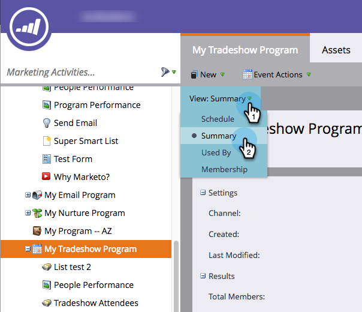

# 編輯事件通道 {#edit-an-event-channel}

您可以從事件的 **摘要** 標籤或 **設定** 標籤。

>[!NOTE]
>
>此選項僅適用於沒有關聯成員的事件。 一旦事件有成員，便無法變更通道類型。

>[!NOTE]
>
>方案是一項特定的行銷計畫。 此 **頻道** 目的是提供傳遞機制，例如網路研討會、貿易展會或線上廣告。 視您自己的例項中可用的項目而定，下拉式清單中可能會顯示不同的管道選項。 您也可以  [建立您自己的管道](/help/marketo/product-docs/administration/tags/create-a-program-channel.md).

## 從「摘要」標籤 {#from-the-summary-tab}

1. 從 **行銷活動**，請從樹狀檢視中選取事件。

   

1. 導覽至 **摘要** 檢視。

   

1. 在 **設定** 類別，選擇當前 **管道** 顯示為超連結。

   

1. 從下拉式清單中選取新管道。

   

1. 按一下 **儲存**.

   

## 從「設定」標籤 {#from-the-setup-tab}

您也可以從事件的 **設定** 標籤。

1. 從樹中選取事件。

   

1. 導覽至 **設定** 標籤。 按兩下當前 **管道**.

   

1. 選取新 **管道**.

   

1. 按一下 **儲存**.

   

恭喜！ 你剛剛編輯了頻道！
