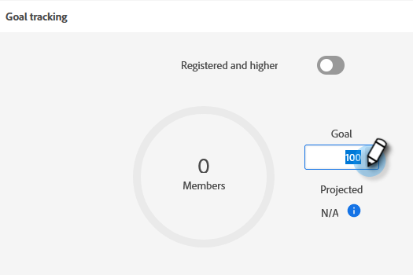

# 設定事件目標 {#setting-event-goals}

為事件指定特定目標並查看其執行情況。

>[!IMPORTANT]
>並非所有客戶都可以訪問此功能。 請聯繫您的客戶成功經理以瞭解詳細資訊。

1. 建立事件程式。

   

1. 選擇 [!UICONTROL 市場活動資料夾]，將活動 [!UICONTROL 名稱]，選擇 [!UICONTROL 程式類型] 和 [!UICONTROL 頻道]。 按一下 **[!UICONTROL 建立]** 完成。

   

1. 在您的活動中，按一下 **[!UICONTROL 報告]** 頁籤。

   

1. 輸入目標 [!UICONTROL 已註冊] 按一下 **[!UICONTROL 設定目標]**。 輸入數字並按Enter鍵。

   

   

1. 重複相同步驟 [!UICONTROL 已出席]。

   

>[!NOTE]
>
>無法在事件啟動後為其設定目標。

就這樣！ 按一下 [!UICONTROL 報告] 頁籤。
