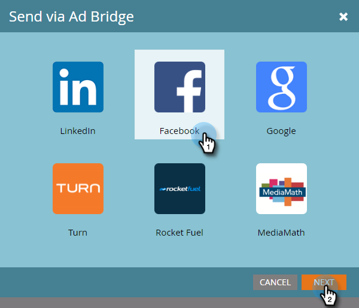

# 在[!DNL Facebook]中新增銷售機會至自訂對象 {#add-leads-to-a-custom-audience-in-facebook}

若要將銷售機會新增至現有的自訂對象，請依照下列步驟進行。

>[!PREREQUISITES]
>
>* [在 [!DNL Facebook]](/help/marketo/product-docs/demand-generation/facebook/create-a-custom-audience-in-facebook.md)中建立自訂對象
>* [在您的[!DNL Facebook]帳戶中接受 [!DNL Facebook]的自訂對象條款](https://www.facebook.com/ads/manage/customaudiences/tos.php)。
>

1. 尋找並選取包含您要新增的潛在客戶的智慧或靜態清單。

   

1. 選取&#x200B;**[!UICONTROL Leads]**&#x200B;標籤，然後按一下底部的&#x200B;**透過廣告Bridge傳送**&#x200B;圖示。

   

1. 選取「**[!UICONTROL Facebook]**」然後按一下「**[!UICONTROL Next]**」。

   

1. 按一下&#x200B;**[!UICONTROL Audience]**&#x200B;下拉式清單，選取您要新增銷售機會的對象，然後按一下&#x200B;**[!UICONTROL Update]**。

   

   >[!NOTE]
   >
   >**[!UICONTROL Add leads to audience]**：只有具有自訂子型別的[!DNL Facebook]個對象可用。
   >**[!UICONTROL Remove leads from audience]**：從[!DNL Facebook]對象中移除靜態或智慧清單中的潛在客戶。

1. 完成後，狀態將更新。

   

   程式已完成。

   >[!NOTE]
   >
   >[在 [!DNL Facebook]](/help/marketo/product-docs/demand-generation/facebook/create-a-custom-audience-in-facebook.md)中建立自訂對象
