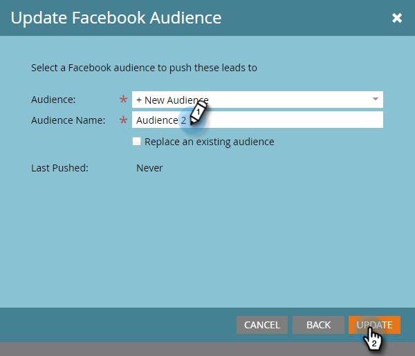

# 在Facebook中建立自訂對象 {#create-a-custom-audience-in-facebook}

>[!PREREQUISITES]
>
>* [將Facebook自訂對象新增為LaunchPoint服務](/help/marketo/product-docs/demand-generation/ad-network-integrations/add-facebook-custom-audiences-as-a-launchpoint-service.md){target=&quot;_blank&quot;}（在「管理」區段中）。
>* [接受Facebook的自訂對象條款](https://www.facebook.com/ads/manage/customaudiences/tos.php){target=&quot;_blank&quot;}。

>[!TIP]
>
>深入了解 [facebook中的自訂對象](https://www.facebook.com/help/341425252616329){target=&quot;_blank&quot;}。

1. 尋找並選取智慧型或靜態清單，其中包含您要從中建立受眾的潛在客戶。

   

1. 選取 **銷售機會** ，然後按一下 **透過廣告橋接傳送** 表徵圖。

   

1. 選擇 **Facebook** 按一下 **下一個**.

   

1. 按一下 **對象** 下拉式清單並選取 **+新受眾**.

   

   >[!IMPORTANT]
   >
   >facebook API可讓每個Facebook廣告帳戶最多允許500個自訂對象。

1. 輸入 **對象名稱**. 按一下 **更新**.

   

   >[!NOTE]
   >
   >如果您有多個Facebook廣告帳戶，您會看到其他下拉式清單，讓您選擇建立此對象的廣告帳戶。

   >[!TIP]
   >
   >想要將新受眾交換為目前與廣告集或群組相關聯的現有受眾嗎？ 選取 **取代現有對象** 框。 執行此操作將 **not** 刪除要取代的對象。

1. 完成後，狀態對話方塊將會更新。

   

   就這樣！ 在Facebook中，您會在 **廣告管理員** > **對象**.

   

   >[!NOTE]
   >
   >您推送至Facebook的所有清單都會變成靜態。 Marketo中的智慧型清單不會自動更新Facebook中的對象清單，以反映傳輸後所做的任何變更。

   >[!TIP]
   >
   >請參閱 [FacebookMarketo客戶的學習路徑](https://facebook.exceedlms.com/student/enrollments/create_enrollment_from_token/BF9TqSaCvM73PP4ScjhCm4fi){target=&quot;_blank&quot;}。 涵蓋您需要知道的所有事項，從建立Facebook頁面，到使用Marketo的廣告網路整合來鎖定Facebook廣告。

   >[!MORELIKETHIS]
   >
   >[在Facebook中新增銷售機會至自訂對象](/help/marketo/product-docs/demand-generation/facebook/add-leads-to-a-custom-audience-in-facebook.md)
