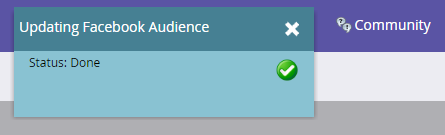

# 在[!DNL Facebook]中建立自訂對象 {#create-a-custom-audience-in-facebook}

>[!PREREQUISITES]
>
>* 在管理區段中[新增 [!DNL Facebook] 自訂對象做為LaunchPoint Service](/help/marketo/product-docs/demand-generation/ad-network-integrations/add-facebook-custom-audiences-as-a-launchpoint-service.md){target="_blank"}。
>* 在您的[帳戶中 [!DNL Facebook]接受](https://www.facebook.com/ads/manage/customaudiences/tos.php){target="_blank"}的自訂對象條款[!DNL Facebook]。

>[!TIP]
>
>深入瞭解[&#x200B; [!DNL Facebook]中的](https://www.facebook.com/help/341425252616329){target="_blank"}自訂對象。

1. 尋找並選取智慧或靜態清單，其中包含您要建立對象的潛在客戶。

   

1. 選取&#x200B;**[!UICONTROL Leads]**&#x200B;標籤，然後按一下底部的&#x200B;**透過廣告Bridge傳送**&#x200B;圖示。

   

1. 選取「**[!UICONTROL Facebook]**」然後按一下「**[!UICONTROL Next]**」。

   

1. 按一下「**[!UICONTROL Audience]**」下拉式選單，選取「**[!UICONTROL + New Audience]**」。

   

   >[!IMPORTANT]
   >
   >Facebook API允許每個Facebook廣告帳戶最多500個自訂對象。

1. 輸入&#x200B;**[!UICONTROL Audience Name]**。 按一下「**[!UICONTROL Update]**」。

   

   >[!NOTE]
   >
   >如果您有多個[!DNL Facebook]廣告帳戶，您會看到另一個下拉式清單，可讓您選擇建立此對象的廣告帳戶。

   >[!TIP]
   >
   >想要將新對象與目前與廣告集或群組相關聯的現有對象交換嗎？ 選取&#x200B;**[!UICONTROL Replace an existing audience]**&#x200B;核取方塊。 執行此動作將&#x200B;**不會**&#x200B;刪除要取代的對象。

1. 完成後，狀態對話方塊將更新。

   

   就是這樣！ 在Facebook中，您會在&#x200B;**廣告管理員** > **對象**&#x200B;中看到新對象。

   

   >[!NOTE]
   >
   >您推送到[!DNL Facebook]的所有清單都會變成靜態。 Marketo中的智慧列示將不會自動更新[!DNL Facebook]中的對象清單以反映傳輸後所做的任何變更。

   >[!MORELIKETHIS]
   >
   >[在 [!DNL Facebook]](/help/marketo/product-docs/demand-generation/facebook/add-leads-to-a-custom-audience-in-facebook.md)中新增銷售機會至自訂對象
