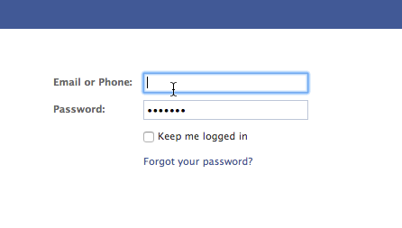

# 將登入頁面發佈至Facebook {#publish-landing-pages-to-facebook}

您可以將登入頁面發佈至Facebook，與已在等候訪問的對象會面，並為您的程式產生更多流量。

>[!AVAILABILITY]
>
>SMB Spark、Standard和Select。 具備獨立授權功能的企業。

>[!PREREQUISITES]
>
>您的頁面必須至少有2,000個讚，您才能發佈至Facebook。

假設您正在發行新書，您可能會透過電子郵件和網站與部分讀者接觸。 額外將Marketo登陸頁面發佈到您的Facebook Brand Page可觸及更多受眾，並鼓勵共用您的優惠方案。

1. 選取已核准的登陸頁面。

   

1. 選取 **發佈至Facebook** 從登陸頁面動作。

   

   >[!NOTE]
   >
   >此技巧會將您的登陸頁面發佈至Facebook應用程式(先前稱為Facebook標籤)。 由於Facebook應用程式無法在行動裝置上使用，因此當訪客嘗試存取您發佈至行動裝置上Facebook應用程式的登陸頁面時，此技術將無法運作。

1. 授權Marketo發佈至您的Facebook頁面。

   

1. 輸入您的Facebook認證。

   

   >[!NOTE]
   >
   >您必須使用擁有您要發佈Marketo登陸頁面之Facebook頁面管理員許可權的帳戶。

1. 選取 **facebook頁面** 您要發佈登入頁面的位置，並輸入Marketo登入頁面應該顯示在該位置的名稱。

   

   >[!NOTE]
   >
   >若要取代您先前發佈至Facebook的Marketo登陸頁面，請選取 **取代現有索引標籤** 並從下拉式清單中選擇要取代的標籤。 請注意，這不會取代非Marketo標籤。

1. 潛在客戶現在可以直接在您的Facebook頁面上造訪您的登陸頁面。 只需按一下「封面」影像下的標簽名稱。

   

   >[!NOTE]
   >
   >若要從Facebook移除登入頁面，請在Marketo中取消核准該頁面，然後在出現提示時，選取移除Facebook索引標籤的選項。
