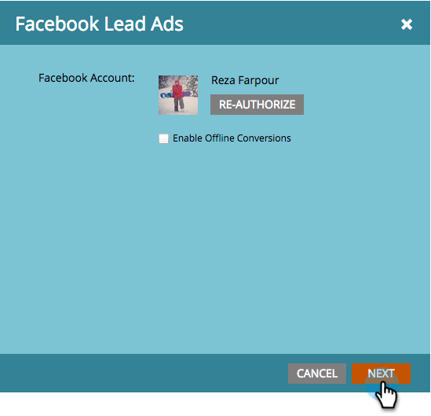
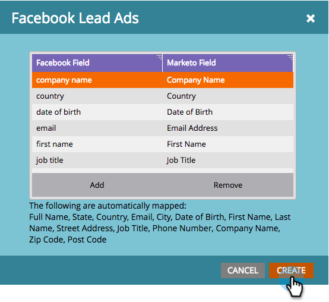

# 設定 Facebook 商機廣告 {#set-up-facebook-lead-ads}

使用[Facebook銷售機會廣告](https://www.facebook.com/business/ads/ad-objectives/lead-generation){target="_blank"}在Facebook中執行廣告行銷活動，並產生Marketo的銷售機會。

>[!NOTE]
>
>**需要管理員許可權**

>[!AVAILABILITY]
>
>若要將Facebook銷售機會廣告新增至您的執行個體，請聯絡Adobe客戶團隊（您的客戶經理）。

1. 在Marketo Engage中，移至&#x200B;**管理員**&#x200B;區域。

   

1. 移至&#x200B;**LaunchPoint**，按一下&#x200B;**新增**&#x200B;下拉式清單，然後選取&#x200B;**新增服務**。

   

1. 為您的服務輸入&#x200B;**[!UICONTROL Display Name]**，從下拉式清單中選取&#x200B;**[!UICONTROL Facebook Lead Ads]**&#x200B;服務，然後按一下&#x200B;**[!UICONTROL Create]**。

   

1. 在相同的瀏覽器中開啟新標籤，並移至[facebook.com](https://www.facebook.com){target="_blank"}。 使用您要用於整合的帳戶登入Facebook。

   >[!NOTE]
   >
   >[!DNL Facebook]帳戶需要存取您想要從中提取潛在客戶廣告的所有[!DNL Facebook]商業頁面。

   

1. 在您登入[!DNL Facebook]後，請返回Marketo並按一下&#x200B;**[!UICONTROL Authorize]**。

   

1. 如果出現提示，請按一下&#x200B;**[!UICONTROL OK]**&#x200B;接受Marketo應用程式安裝到[!DNL Facebook]。

   

1. 您會發現現在已獲得授權。 按一下「**[!UICONTROL Next]**」。

   

1. 選取您要Marketo從中提取[!UICONTROL Facebook Lead Ads]的頁面，然後按一下&#x200B;**[!UICONTROL Next]**。

   >[!TIP]
   >
   >如果您沒有看到預期的頁面，請確定用於驗證的[!DNL Facebook]帳戶已新增到[!DNL Facebook]上的頁面，然後再試一次。

   

1. 若要接受預設的[!DNL Facebook]到Marketo欄位對應，只要按一下&#x200B;**[!UICONTROL Create]**&#x200B;即可。

   >[!TIP]
   >
   >透過修改對應，您可以自訂銷售機會廣告資料在Marketo中的儲存位置。 您也可以[從潛在客戶廣告自訂問題](/help/marketo/product-docs/demand-generation/facebook/set-up-facebook-lead-ads/map-custom-fields-to-marketo.md){target="_blank"}提取資料。

   >[!CAUTION]
   >
   >Marketo不支援將兩個[!DNL Facebook]欄位對應到單一Marketo欄位，只有1對1。 如果將2對應至1，潛在客戶可能無法進入Marketo系統。

   

   做得很好！ 當您執行成功的[!DNL Facebook]個潛在客戶廣告行銷活動時，潛在客戶將開始流入Marketo。

   

>[!MORELIKETHIS]
>
>* [在潛在客戶存取管理員(Facebook)中指派/移除許可權](https://www.facebook.com/business/help/540596413257598?id=735435806665862){target="_blank"}
>* [在智慧行銷活動中使用潛在客戶廣告篩選器和觸發程式](/help/marketo/product-docs/demand-generation/facebook/use-lead-ads-filters-and-triggers-in-a-smart-campaign.md){target="_blank"}
>* [將自訂欄位對應至Marketo](/help/marketo/product-docs/demand-generation/facebook/set-up-facebook-lead-ads/map-custom-fields-to-marketo.md){target="_blank"}
