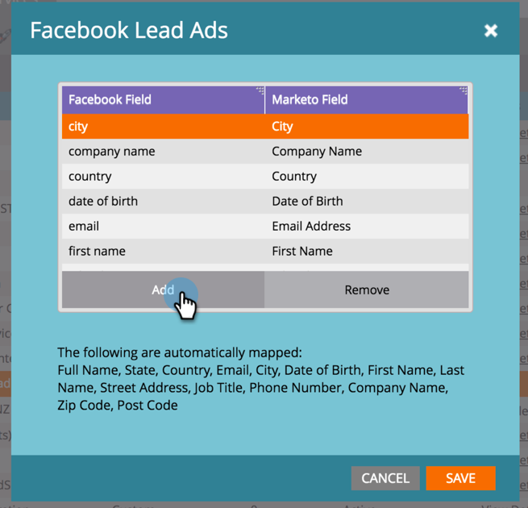

# 將自訂欄位對應至 Marketo {#map-custom-fields-to-marketo}

依預設，您可能想要收集超過標準資訊[!DNL Facebook]儲存的資訊，例如某人使用您的線上傳遞服務的頻率。 您可以透過[在您的[!DNL Facebook]潛在客戶廣告中建立自訂問題](https://www.facebook.com/business/help/774623835981457?helpref=uf_permalink)來完成此作業。

但是，**Marketo不會自動開始收集此資料**。 為了讓Marketo開始擷取自訂欄位值，您&#x200B;**必須**&#x200B;將這些自訂欄位對應到Marketo中的欄位。

請依照下列步驟，在Admin的LaunchPoint區域中設定此專案。

>[!NOTE]
>
>**需要管理員權限**

1. 移至[管理]區域並按一下&#x200B;**[!UICONTROL LaunchPoint]**。 在[已安裝服務]下，尋找並編輯&#x200B;**[!UICONTROL Facebook Lead Ads]**。

   

1. 按一下「**[!UICONTROL Next]**」。

   

1. 將授權帳戶維持原狀，請&#x200B;**不**&#x200B;進行任何變更。 按一下「**[!UICONTROL Next]**」。

   

1. 和以前一樣，將選取的頁面保持原樣，**不會**&#x200B;進行任何變更。 按一下「**[!UICONTROL Next]**」。

   

1. 將自訂[!DNL Facebook]欄位對應到您的Marketo欄位。 按一下&#x200B;**[!UICONTROL Add].**

   

1. 在新列中，輸入[!DNL Facebook]自訂欄位的名稱。

   

   >[!NOTE]
   >
   >只有已儲存至[!DNL Facebook]表單範本的欄位才會在這裡顯示為選項。

1. 按一下&#x200B;**[!UICONTROL Marketo Field]**&#x200B;欄。 輸入以搜尋您要對應的欄位。 選取欄位後，按一下&#x200B;**[!UICONTROL Save]**。

   

   >[!NOTE]
   >
   >如果您在Marketo中還沒有欄位可將[!DNL Facebook]欄位對應到，請瞭解如何[建立自訂欄位](/help/marketo/product-docs/administration/field-management/create-a-custom-field-in-marketo.md)。

>[!CAUTION]
>
>您&#x200B;**必須**&#x200B;針對任何新[!DNL Facebook]欄位進行此程式，以便Marketo收集資料。
