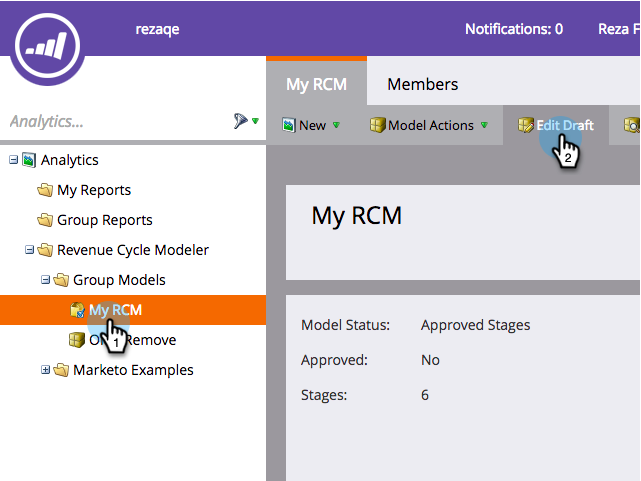

# 設定Facebook離線轉換 {#set-up-facebook-offline-conversions}

透過將離線轉換資料傳回Facebook供透過潛在客戶廣告建立的人使用，您的廣告團隊可以最佳化他們的廣告支出，比以往任何時候都好。 以下說明設定方法。

>[!PREREQUISITES]
>
>* 您必須 [設定Facebook銷售機會廣告](/help/marketo/product-docs/demand-generation/facebook/set-up-facebook-lead-ads.md).
>* 您必須在以下位置擁有已核准的模型： [收入週期Modeler](/help/marketo/product-docs/reporting/revenue-cycle-analytics/revenue-cycle-models/understanding-revenue-models.md).

## 管理員設定 {#admin-configuration}

1. 前往Marketo **管理員**.

   

1. 前往 **啟動點** ，然後按兩下您先前建立的Facebook Lead Ads服務。

   >[!NOTE]
   >
   >如果您尚未執行此動作，請繼續並 [設定Facebook銷售機會廣告](/help/marketo/product-docs/demand-generation/facebook/set-up-facebook-lead-ads.md)，然後返回此處。

   

1. 您也可以編輯 **顯示名稱** 以包含離線轉換。 按一下 **下一個**.

   

1. 檢查 **啟用離線轉換** 並按一下 **下一個**.

   

1. 按一下 **下一個**.

   

1. 按一下 **儲存**.

   

   真貼心！ 您已經完成Facebook離線轉換的啟用工作。 讓我們跳到收入週期Modeler來對應階段。

   

## 收入週期Modeler設定 {#revenue-cycle-modeler-configuration}

1. 前往 **Analytics**.

   

1. 選取您的模型並按一下 **編輯草稿**.

   

   >[!NOTE]
   >
   >目前有10個Facebook事件可將收入週期階段對應至：
   >
   >* 新增付款資訊
   >* 新增至購物車
   >* 新增至希望清單
   >* 註冊完成
   >* 已起始結帳
   >* 個人
   >* 其他
   >* 購買
   >* 搜尋
   >* 內容檢視

1. 選取您要對應的階段，然後從 **facebook轉換** 在下拉式清單中，選取您要對應至的Facebook事件。 重複此步驟，將RCM中的所有階段對應至Facebook上的離線轉換階段。

   

1. 完成對應後，關閉模型。

   

1. 核准您的模型並完成！

   

   現在，當銷售機會廣告銷售機會達到您對應的階段時，轉換會傳送至Facebook進行報告。

   >[!CAUTION]
   >
   >檢查您的Facebook帳戶，並確認所有 [廣告已建立關聯](https://www.facebook.com/business/url/?href=%2Fbusiness%2Fhelp%2Fwww%2F1776828022605281&amp;cmsid&amp;creative=link&amp;creative_detail=advertiser-help-center&amp;create_type&amp;destination_cms_id&amp;orig_http_referrer) Marketo離線轉換事件集。 如果沒有，廣告歸因可能無法運作。

   >[!NOTE]
   >
   >離線轉換資料每天會從Marketo傳送多次到Facebook。

>[!MORELIKETHIS]
>
>[瞭解Facebook離線轉換](/help/marketo/product-docs/demand-generation/facebook/understanding-facebook-offline-conversions.md)
