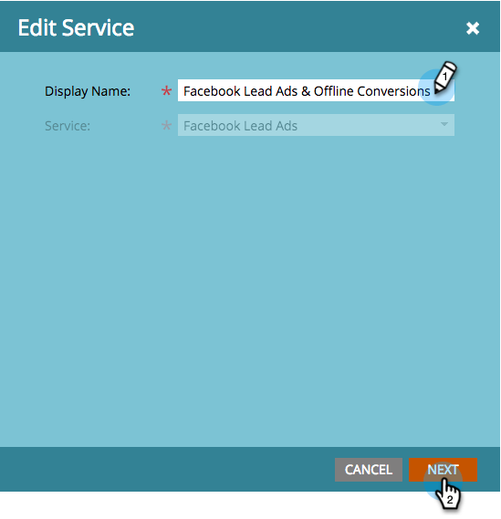

# 設定Facebook離線轉換 {#set-up-facebook-offline-conversions}

透過將線下轉換資料傳回Facebook，讓透過「銷售線索廣告」建立的人員也能使用，您的廣告團隊可以比以往更好地最佳化其廣告支出。 這是如何設定的。

>[!PREREQUISITES]
>
>* 您必須 [設定Facebook銷售線索廣告](set-up-facebook-lead-ads.md)。
>* 您必須在「收入週期建模器」中擁 [有已批准的模型](http://docs.marketo.com/display/docs/revenue+cycle+models)。

>

## 管理設定 {#admin-configuration}

1. 前往Marketto **Admin**。

   

1. 前往 **LaunchPoint** ，然後按兩下您先前建立的Facebook銷售線索廣告服務。

   >[!NOTE]
   >
   >如果您尚未這麼做，請繼續「設定 [Facebook潛在客戶廣告](set-up-facebook-lead-ads.md)」，然後再回來。

   

1. 如果您喜歡，請編輯「顯 **示名稱** 」以包含「離線轉換」。 按一 **下「下一步**」。

   

1. 勾選「 **啟用離線轉換** 」，然後按 **「下一步**」。

   

1. 按一 **下「下一步**」。

   

1. 按一下 **儲存**。

   

   真貼心！ 啟用Facebook離線轉換已完成一半。 讓我們跳至「收入週期建模器」來對應各個階段。

   

## 收入週期建模器配置 {#revenue-cycle-modeler-configuration}

1. 前往 **Analytics**。

   

1. 選取模型，然後按一下「編 **輯草稿」(Edit Draft**)。

   

   >[!NOTE]
   >
   >目前，您有10個Facebook事件可將收入週期階段對應至：
   >
   >    
   >    
   >    * 新增付款資訊
   >    * 新增至購物車
   >    * 添加到願望清單
   >    * 註冊完成
   >    * 已啟動結帳
   >    * 人物
   >    * 其他
   >    * 購買
   >    * 搜尋
   >    * 內容檢視

1. 選取您要對應的舞台，然後從「 **** Facebook轉換」下拉式清單中，選取您要對應至的Facebook事件。 重複此步驟，將RCM中的所有階段映射到Facebook上的離線轉換階段。

   

1. 完成映射後，關閉模型。

   

1. 批准您的模型，您就完成！

   

   現在，當「銷售機會廣告」銷售機會到達您對應的階段時，轉換會傳送至Facebook以進行報告。

   >[!CAUTION]
   >
   >檢查您的Facebook帳戶，並確保所有 [廣告都與](https://www.facebook.com/business/url/?href=%2Fbusiness%2Fhelp%2Fwww%2F1776828022605281&amp;cmsid&amp;creative=link&amp;creative_detail=advertiser-help-center&amp;create_type&amp;destination_cms_id&amp;orig_http_referrer) 「行銷人員離線轉換事件集」相關聯。 如果沒有，廣告歸因可能無法運作。

   >[!NOTE]
   >
   >「離線轉換資料」每天會從Marketing多次傳送至Facebook。

>[!NOTE]
>
>**相關文章**
>
>* [瞭解Facebook離線轉換](understanding-facebook-offline-conversions.md)

>

