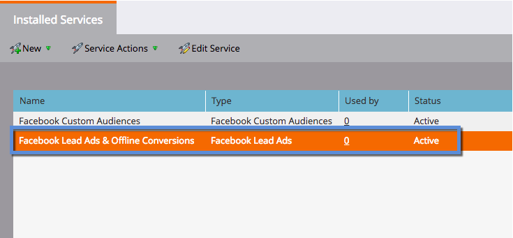

# 設定[!DNL Facebook]個離線轉換 {#set-up-facebook-offline-conversions}

透過將透過「銷售機會廣告」建立之個人的離線轉換資料傳回[!DNL Facebook]，您的廣告團隊可以最佳化他們的廣告支出，比以往更好。 以下說明設定方法。

>[!PREREQUISITES]
>
>* 您必須[設定Facebook潛在客戶廣告](/help/marketo/product-docs/demand-generation/facebook/set-up-facebook-lead-ads.md)。
>* 您在[收入週期Modeler](/help/marketo/product-docs/reporting/revenue-cycle-analytics/revenue-cycle-models/understanding-revenue-models.md)中必須有已核准的模型。

## 管理員設定 {#admin-configuration}

1. 前往Marketo **[!UICONTROL Admin]**。

   

1. 前往&#x200B;**[!UICONTROL LaunchPoint]**&#x200B;並連按兩下您先前建立的Facebook潛在客戶廣告服務。

   >[!NOTE]
   >
   >如果您尚未執行此動作，請繼續並[設定[!UICONTROL Facebook Lead Ads]](/help/marketo/product-docs/demand-generation/facebook/set-up-facebook-lead-ads.md)，然後再回到這裡。

   

1. 您也可以編輯&#x200B;**[!UICONTROL Display Name]**&#x200B;以包含離線轉換。 按一下「**[!UICONTROL Next]**」。

   

1. 檢查&#x200B;**[!UICONTROL Enable Offline Conversions]**&#x200B;並按一下&#x200B;**[!UICONTROL Next]**。

   

1. 按一下「**[!UICONTROL Next]**」。

   

1. 按一下「**[!UICONTROL Save]**」。

   

   真貼心！ 您已經完成[!DNL Facebook]個離線轉換。 讓我們跳到收入週期Modeler來對應階段。

   

## 收入週期Modeler設定 {#revenue-cycle-modeler-configuration}

1. 移至&#x200B;**[!UICONTROL Analytics]**。

   

1. 選取您的模型並按一下&#x200B;**[!UICONTROL Edit Draft]**。

   

   >[!NOTE]
   >
   >目前有10個[!DNL Facebook]事件可將收入週期階段對應至：
   >
   >* 新增付款資訊
   >* 新增至購物車
   >* 新增至希望清單
   >* 註冊完成
   >* 已起始結帳
   >* 個人
   >* 其他
   >* 購買
   >* 搜尋
   >* 內容檢視

1. 選取您要對應的階段，然後從&#x200B;**[!UICONTROL Facebook Conversion]**&#x200B;下拉式清單中，選取您要與其對應的事件[!DNL Facebook]。 重複此步驟，將RCM中的所有階段對應至[!DNL Facebook]上的離線轉換階段。

   

1. 完成對應後，關閉模型。

   

1. 核准您的模型並完成！

   

   現在，當銷售機會廣告銷售機會達到您對應的階段時，轉換會傳送至[!DNL Facebook]進行報告。

   >[!CAUTION]
   >
   >檢查您的[!DNL Facebook]帳戶，並確認所有[廣告皆與Marketo離線轉換事件集相關聯](https://www.facebook.com/business/url/?href=%2Fbusiness%2Fhelp%2Fwww%2F1776828022605281&cmsid&creative=link&creative_detail=advertiser-help-center&create_type&destination_cms_id&orig_http_referrer)。 如果沒有，廣告歸因可能無法運作。

   >[!NOTE]
   >
   >離線轉換資料每天會從Marketo傳送幾次到[!DNL Facebook]。

>[!MORELIKETHIS]
>
>[瞭解 [!DNL Facebook] 離線轉換](/help/marketo/product-docs/demand-generation/facebook/understanding-facebook-offline-conversions.md)
