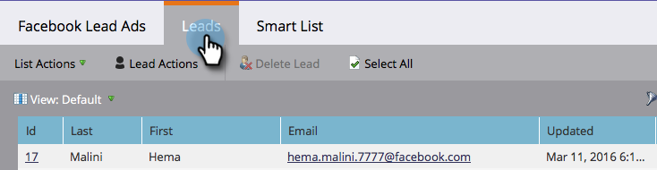

# 測試[!DNL Facebook]個銷售機會廣告以與Marketo進行行動整合 {#test-facebook-lead-ads-for-mobile-integration-with-marketo}

在您建立潛在客戶廣告後，應加以測試。

>[!PREREQUISITES]
>
>您必須[設定[!UICONTROL Facebook Lead Ads]整合](/help/marketo/product-docs/demand-generation/facebook/set-up-facebook-lead-ads.md)。

1. 在[!UICONTROL Facebook Power Editor]中，選取行銷活動、廣告，然後按一下&#x200B;**[!UICONTROL Edit]**。

1. 在&#x200B;**[!UICONTROL Links]**&#x200B;底下，按一下&#x200B;**[!UICONTROL View on mobile app]**&#x200B;連結。

   

1. 新通知將傳送至您可使用授權帳戶在行動裝置上存取的[!DNL Facebook]帳戶。 按一下「**[!UICONTROL OK]**」。

   

1. 在您的行動裝置上，在[!DNL Facebook]行動應用程式中點選&#x200B;**[!UICONTROL Notifications]**。

   

1. 在[通知]中，點選&#x200B;**[!UICONTROL Your ad is ready to preview]**。

   

1. 點選您的Call to action並填寫您建立的表單，以提交您的測試Lead Ad單位。

   

   >[!NOTE]
   >
   >此範例使用瞭解更多Call to action。 您的潛在客戶廣告單位Call to action可能會不同。

1. 提交表單後，在Marketo[&#128279;](/help/marketo/product-docs/core-marketo-concepts/smart-lists-and-static-lists/creating-a-smart-list/create-a-smart-list.md)中建立智慧清單，作為使用&#x200B;**[!UICONTROL Filled Out Facebook Lead Ads Form]**&#x200B;篩選器的方案或潛在客戶資料庫的一部分。 插入您提交之表單的銷售機會廣告表單名稱。

   

1. 現在按一下Leads索引標籤，驗證同步是否正常運作。

   

>[!NOTE]
>
>[設定[!UICONTROL Facebook Lead Ads]](/help/marketo/product-docs/demand-generation/facebook/set-up-facebook-lead-ads.md)
