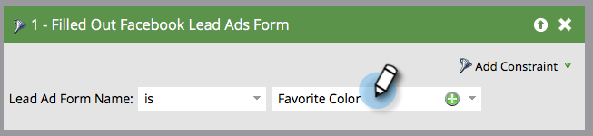

# 測試Facebook銷售線索廣告以利與Marketo的行動整合{#test-facebook-lead-ads-for-mobile-integration-with-marketo}

在您建立Lead Ad後，您應加以測試！

>[!PREREQUISITES]
>
>您必須[設定Facebook銷售機會廣告整合](set-up-facebook-lead-ads.md)。

1. 在Facebook強大編輯器中，選取促銷活動、廣告，然後按一下「編輯」****。
1. 在「**連結**」下方，按一下「在行動應用程式上檢視」連結。****

   

1. 系統會傳送新通知給Facebook帳戶，您可透過授權帳戶在行動裝置上存取該帳戶。 按一下&#x200B;**確定**。

   

1. 在您的行動裝置上，點選Facebook行動應用程式中的「通知」****。

   

1. 在「通知」中，點選「**您的廣告已準備好預覽**」。

   

1. 點選您的「行動要求」並填寫您建立的表格，以提交您的測試銷售機會廣告單元。

   

   >[!NOTE]
   >
   >這只是一個使用「瞭解更多行動要求」的範例。 您的銷售機會廣告單位行動要求可能不同。

1. 魔法就在這裡發生！ 提交表單後，[會在Marketo](../../../product-docs/core-marketo-concepts/smart-lists-and-static-lists/creating-a-smart-list/create-a-smart-list.md)中建立智慧型清單，作為程式的一部分，或在使用&#x200B;**Filled Out Facebook潛在客戶廣告表單**&#x200B;篩選的潛在客戶資料庫中。 插入您剛提交的表單的銷售機會廣告表單名稱。

   

1. 現在，按一下「銷售線索」標籤以驗證同步是否正常運作。

   

   那酷嗎？

>[!NOTE]
>
>**相關文章**
>
>* [啟用／停用Facebook銷售線索廣告](set-up-facebook-lead-ads.md)

>

