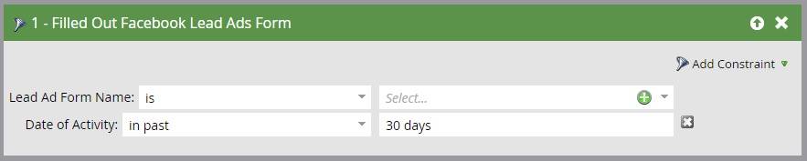

# 在Smart Campaign中使用銷售機會廣告篩選器和觸發程式 {#use-lead-ads-filters-and-triggers-in-a-smart-campaign}

當您啟用Facebook銷售機會廣告時，您可以在智慧行銷活動中使用這些廣告來檢視計畫成功。 當使用者在Facebook銷售機會廣告單元中提交資訊時，該資訊會立即推送至Marketo。

1. 使用 **填寫潛在客戶廣告表單** 篩選或觸發。

   

1. 新增限制以自訂。

   
