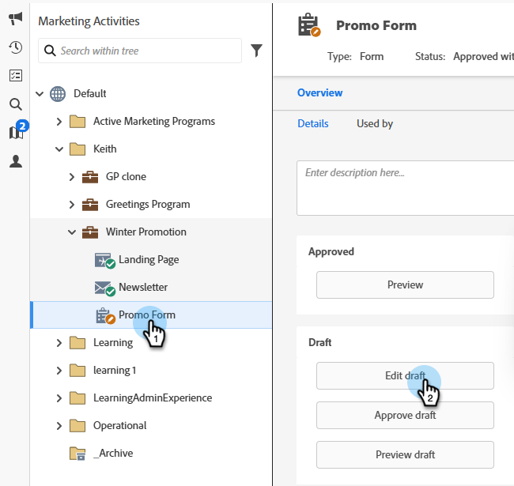

# 新增欄位至表單 {#add-a-field-to-a-form}

當您[建立表單](/help/marketo/product-docs/demand-generation/forms/creating-a-form/create-a-form.md){target="_blank"}並[選取主題](/help/marketo/product-docs/demand-generation/forms/creating-a-form/select-a-form-theme.md){target="_blank"}後，您可能想要新增其他欄位供人員填寫。 方法如下。

1. 移至&#x200B;**[!UICONTROL Marketing Activities]**。

   

1. 選取您的表單並按一下&#x200B;**[!UICONTROL Edit Draft]**

   

   >[!NOTE]
   >
   >如果需要的表單處於&#x200B;_已核准_&#x200B;狀態，您必須先按一下&#x200B;**建立草稿**。

1. 在表單中，按一下&#x200B;**+**&#x200B;符號。

   

   >[!NOTE]
   >
   >當您建立新表單時，[!UICONTROL First Name]、[!UICONTROL Last Name]和[!UICONTROL Email Address]會自動新增。

1. 尋找並選取您要新增至表單的欄位。

   

1. 新增您需要的欄位，然後按一下&#x200B;**[!UICONTROL Finish]**。

   

1. 按一下「**[!UICONTROL Approve and Close]**」。

   

>[!NOTE]
>
>請務必核准因表單變更而建立的任何登入頁面草稿。

>[!MORELIKETHIS]
>
>[將表單欄位設為必填](/help/marketo/product-docs/demand-generation/forms/creating-a-form/make-a-form-field-required.md){target="_blank"}
