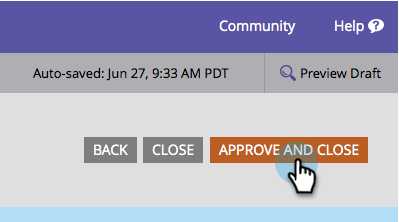

# 核准表單 {#approve-a-form}

若要將表單新增至您的其中一個登入頁面，該表單必須經過核准。 以下是其操作方式。

## 核准表單 {#approve-a-form-1}

以下說明如何核准已準備就緒的現有表單。

1. 前往 **行銷活動**.

   

1. 尋找並選取您的表單。

   

1. 下 **表單動作**，按一下 **核准**.

   

1. 注意到綠色核取記號嗎？

   

   已核准並準備就緒 [新增至登入頁面](/help/marketo/product-docs/demand-generation/landing-pages/understanding-landing-pages/approve-unapprove-or-delete-a-landing-page.md).

   >[!NOTE]
   >
   >核准後所做的變更可能需要幾分鐘的時間才能更新內嵌表單。

## 從編輯器核准表單 {#approve-a-form-from-the-editor}

如果您對表單進行變更，可以直接從編輯器核准頁面。

>[!PREREQUISITES]
>
>[編輯表單](/help/marketo/product-docs/demand-generation/forms/form-actions/edit-a-form.md)

1. 按一下 **完成**.

   

1. 按一下 **核准並關閉**.

   
