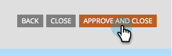

# 核准表單 {#approve-a-form}

若要將表單新增至您的其中一個登入頁面，該表單必須經過核准。

## 核准表單 {#approve}

以下說明如何核准已可立即使用的現有表單。

1. 移至&#x200B;**[!UICONTROL Marketing Activities]**。

   

1. 選取所需的表單並按一下&#x200B;**[!UICONTROL Approve draft]**。

   

   綠色核取記號隨即出現。

   

   已核准並準備好[新增到登陸頁面](/help/marketo/product-docs/demand-generation/landing-pages/understanding-landing-pages/approve-unapprove-or-delete-a-landing-page.md){target="_blank"}。

   >[!NOTE]
   >
   >核准後所做的變更可能需要幾分鐘的時間才能更新內嵌表單。

## 從編輯器核准表單 {#approve-from-the-editor}

您可以直接從表單編輯器核准表單。

>[!PREREQUISITES]
>
>[編輯表單](/help/marketo/product-docs/demand-generation/forms/form-actions/edit-a-form.md)

1. 在表單中，按一下&#x200B;**[!UICONTROL Finish]**。

   

1. 按一下「**[!UICONTROL Approve and Close]**」。

   
