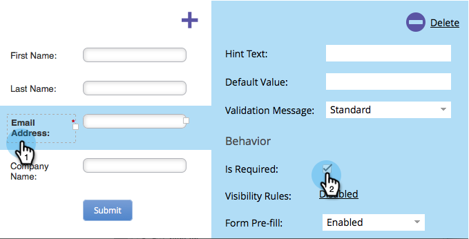

# 使表單欄位成為必填欄位 {#make-a-form-field-required}

當[將欄位新增至表單](/help/marketo/product-docs/demand-generation/forms/creating-a-form/add-a-field-to-a-form.md){target="_blank"}時，您可能想要讓填寫欄位的人需要一些欄位。 方法如下。

1. 移至&#x200B;**[!UICONTROL Marketing Activities]**。

   

1. 選取您的表單並按一下&#x200B;**[!UICONTROL Create draft]**。

   

   >[!NOTE]
   >
   >如果您的表單未核准，請按一下&#x200B;**編輯草稿**。

1. 選取您要設為必要欄位，並核取&#x200B;**[!UICONTROL Is Required]**。

   

1. 做得很好！ 按一下「**[!UICONTROL Finish]**」。

   

1. 按一下「**[!UICONTROL Approve and Close]**」。

   

>[!NOTE]
>
>別忘了[核准此表單繼續存在的所有登陸頁面](/help/marketo/product-docs/demand-generation/landing-pages/understanding-landing-pages/approve-unapprove-or-delete-a-landing-page.md){target="_blank"}，讓變更生效。

>[!MORELIKETHIS]
>
>[重新排序您新增至表單的欄位](/help/marketo/product-docs/demand-generation/forms/form-fields/reorder-fields-in-a-form.md){target="_blank"}
