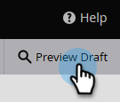

# 預覽表單 {#preview-a-form}

發佈之前，您可以在此快速且簡單的表單預覽器中檢視表單。

1. 移至&#x200B;**[!UICONTROL Marketing Activities]**。

   

1. 選取您的表單並按一下&#x200B;**[!UICONTROL Preview]**。

   

   >[!NOTE]
   >
   >如果您的表單未核准，請按一下&#x200B;**預覽草稿**。

1. 表單編輯器將會以&#x200B;_預覽_&#x200B;模式開啟。

   

1. 按一下&#x200B;**[!UICONTROL Edit Draft]**&#x200B;以返回&#x200B;_編輯_&#x200B;模式。

   

1. 按一下&#x200B;**[!UICONTROL Preview Draft]**&#x200B;即可輕鬆切換回來。

   
