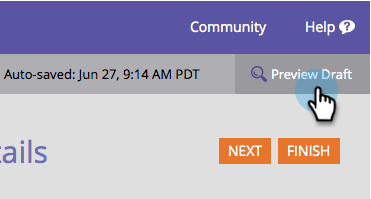

# 預覽表單 {#preview-a-form}

發佈之前，您可以在這個快速簡單的表單預覽器中查看表單。

1. 前往 **行銷活動**.

   

1. 尋找並選取您的表單。

   

1. 在 **表單動作**，按一下 **預覽**.

   

1. 表單編輯器將在中開啟 **預覽** 模式。

   

1. 按一下 **編輯草稿** 返回 **編輯** 模式。

   

1. 按一下即可輕鬆切換回 **預覽草稿**.

   

這不容易嗎？ 現在您知道在變更時如何預覽表單。
