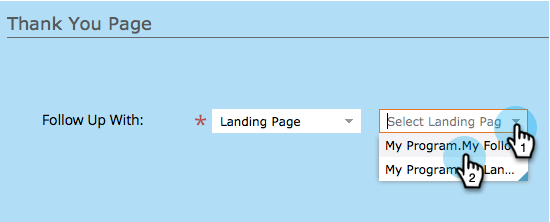

# 設定表單感謝頁面{#set-a-form-thank-you-page}

當有人填寫表格時，會發生什麼？ 他們轉到哪裡去？ 以下是如何設定它。

## 編輯表單{#edit-form}

1. 前往&#x200B;**行銷活動**。

   

1. 選擇表單並按一下「編輯表單」。****

   

1. 在「**表單設定**」下方，按一下「設定&#x200B;**a3/>」。**

   

1. 向下捲動至&#x200B;**感謝頁面**&#x200B;區段。

## 保持在頁面{#stay-on-page}上

當表單提交後，「停留在頁面上」選項會將訪客保留在相同的頁面上。

1. 為&#x200B;**選擇**&#x200B;保持在頁面上&#x200B;**以跟進**。

   

## 外部URL {#external-url}

「外部URL」設定可讓您將任何URL定義為後續頁面。 使用者提交表單後，就會將其導向至指定的URL。

1. 選擇&#x200B;********&#x200B;的「跟進」。

   

1. 輸入完整的URL。

   

>[!TIP]
>
>URL可以是某處托管的檔案的URL —— 如果您這麼做，「提交」按鈕的行為就像「下載」按鈕。

## 著陸頁面{#landing-page}

您可以選取任何已核准的行銷人員登陸頁面作為後續動作。

1. 將「**跟進**」設為「著陸頁面&#x200B;**」。**

   

1. 尋找並選取您想要的著陸頁面。

   

## 動態感謝頁面{#dynamic-thank-you-pages}

您可以新增多個選項，並內建選項，以根據人們的回應來顯示不同的後續動作。

1. 按一下&#x200B;**添加選擇**。

   

1. 選擇要監視響應的欄位。

   

   >[!TIP]
   >
   >只有新增至表單的欄位才適用。

1. 選擇所需的邏輯運算子。

   

1. 輸入用戶將響應的值之一。

   

1. 為&#x200B;**「跟進**」類型選擇適當的頁面。

   

1. 選取適當的著陸頁面。

   

   >[!NOTE]
   >
   >您必須事先建立／核准這些著陸頁面。

1. 按一下&#x200B;**+**&#x200B;符號以新增其他選項。

   

   >[!NOTE]
   >
   >您可以新增數種選擇。 但是，如果您新增太多，可能會影響表單的載入速度，因此只需新增所需項目。

1. 瀏覽並設定&#x200B;**選擇2**。

   

   >[!TIP]
   >
   >您可隨意混搭後續類型。 您可以針對某個選項使用著陸頁面，另一個選項則使用URL。

1. 設定所有其他回應的預設頁面。

   

1. 選擇頁面本身，然後按一下&#x200B;**保存**。

   

   好了，看起來不錯！

   

1. 按一下&#x200B;**完成**。

   

1. 按一下「核准並關閉」。****

   

幹得好！

