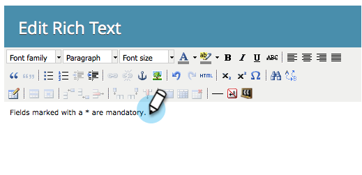

# 將富格文本添加到表單{#add-rich-text-to-a-form}

在表單中使用Rich Text，在欄位之間新增指示或其他資訊。 看看。

1. 前往&#x200B;**行銷活動**。

   

1. 選擇表單並按一下「編輯表單」。****

   

1. 按一下&#x200B;**+**&#x200B;符號。

   

1. 選擇&#x200B;**富格文本**。

   

1. 輸入所需的文本。

   

   >[!TIP]
   >
   >如果您需要表單中的行分隔符，請使用「水準行」按鈕。

1. 按一下&#x200B;**保存**。

   

1. 按一下&#x200B;**完成**。

   

1. 按一下「核准並關閉」。****

   

   幹得漂亮！ 看看。

   

>[!TIP]
>
>您是否知道您也可以[將可見性規則](/help/marketo/product-docs/demand-generation/forms/form-fields/dynamically-toggle-visibility-of-a-form-field.md)新增至Rich Text區塊？
