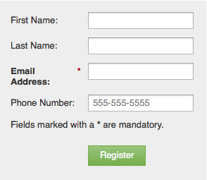

# 將豐富式文字新增至表格 {#add-rich-text-to-a-form}

在表單中使用Rich Text，在欄位之間新增指示或其他資訊。 看看。

1. 前往「行 **銷****活動」**。

   

1. 選擇您的表單，然後按一 **下「編輯****表單**」。

   

1. 按一下 **+** 號。

   

1. 選擇 **Rich Text**。

   

1. 輸入所需的文本。

   

   >[!TIP]
   >
   >如果您需要表單中的行分隔符，請使用「水準行」按鈕。

1. 按一下 **儲存**。

   

1. 按一 **下完成**。

   

1. 按一 **下「核准並關閉**」。

   

   幹得漂亮！ 看看。

   

>[!NOTE]
>
>**深入探討**
>
>進一步瞭解 [表格](http://docs.marketo.com/display/docs/forms)。

您知道您也可以將可 [見性規則新增至](../../../../product-docs/demand-generation/forms/form-fields/dynamically-toggle-visibility-of-a-form-field.md) rich text區塊嗎？