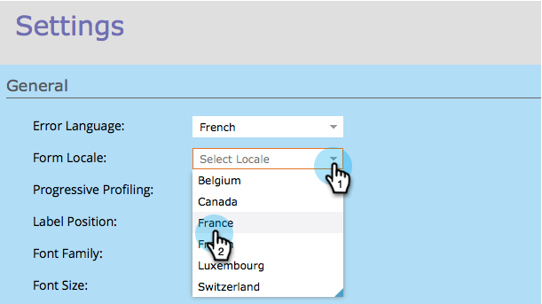

# 變更表單的地區設定 {#change-a-forms-locale}

處理國際表單時，您會想要以正確的格式顯示日期/時間。 Marketo會自動為您執行此操作，您只需設定表單的地區設定，其餘一切由我們處理。

1. 前往 **行銷活動**.

   

1. 選取您的表單並按一下 **編輯表單**.

   

1. 下 **表單設定**，按一下 **設定**.

   

1. 選取 **地區設定** 隨心所欲。

   

1. 按一下 **完成**.

   

1. 按一下 **核准並關閉** 以套用及儲存變更。

   >[!NOTE]
   >
   >此表單必須經過核准才能用於登陸頁面。

   

   >[!NOTE]
   >
   >記住 [核准登入頁面草稿](/help/marketo/product-docs/demand-generation/landing-pages/understanding-landing-pages/approve-unapprove-or-delete-a-landing-page.md) 由表單變更所建立。

   就是這樣！ 人們可以看到以正確地區設定顯示的日期/時間。

   
