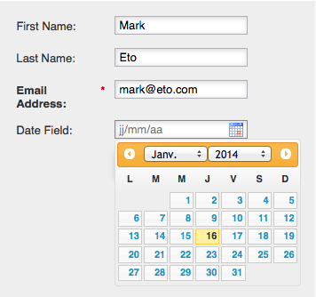

# 更改表單的區域設定{#change-a-forms-locale}

在處理國際表單時，您會想要以正確的格式顯示日期／時間。 Marketto會自動為您執行此動作，您只需設定表單的地區設定，其他事由我們處理。

1. 前往&#x200B;**Marketing** **Activity**。

   

1. 選擇表單並按一下「編輯」******「表單」**。

   

1. 在&#x200B;**Form****Settings**&#x200B;下，按一下&#x200B;**Settings**。

   

1. 選擇您選擇的&#x200B;**地區**。

   

1. 按一下&#x200B;**完成**。

   

1. 按一下**「核准並關閉**」以套用並儲存變更。

   >[!NOTE]
   >
   >表單必須經過核准才能用於登陸頁面。

   

   >[!NOTE]
   >
   >**提醒**
   >
   >
   >請記得[核准表單變更所建立的著陸頁面草稿](../../../../product-docs/demand-generation/landing-pages/understanding-landing-pages/approve-unapprove-or-delete-a-landing-page.md)。

1. 
1. 就這樣！ 人們可以看到日期／時間顯示在正確的地區設定中。

   

