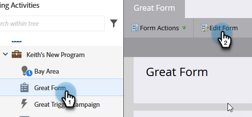
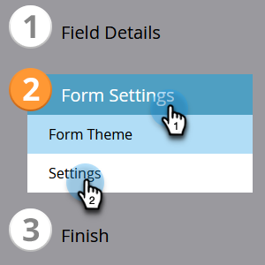

# 變更表單語言 {#change-the-language-of-a-form}

了解如何變更表單的語言。

1. 前往 **行銷活動**.

   

1. 選取您的表單並按一下 **編輯表單**.

   

1. 按一下 **表單設定** 選取 **設定**.

   

1. 選取所需 **表單語言**.

   

   可選步驟：選擇所選語言的地區/地區。

   

1. 按一下 **完成**.

   

1. 按一下 **核准並關閉** 以套用和儲存變更。

   

   >[!NOTE]
   >
   >表單必須經過核准，才能用於登錄頁面。

   >[!TIP]
   >
   >記住 [核准登錄頁面](/help/marketo/product-docs/demand-generation/landing-pages/understanding-landing-pages/approve-unapprove-or-delete-a-landing-page.md) 由窗體建立的草稿更改。

您的表單現在會反映您選取的語言。

