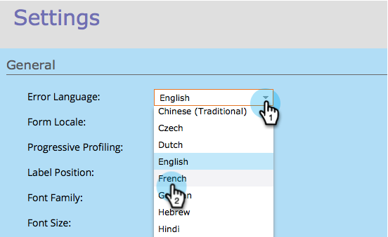

# 更改表單驗證/錯誤消息和提交按鈕的語言 {#change-the-language-of-form-validation-error-messages-and-submit-button}

您知道可以自訂表單，以使用其他語言提供訊息嗎？ 看看這個.

>[!NOTE]
>
>這也會變更提交按鈕語言。

1. 前往 **行銷活動**.

   

1. 選取您的表單並按一下 **編輯表單**.

   

1. 在 **表單設定**，按一下 **設定**.

   

1. 選取 **錯誤語言** 你需要。

   

1. 按一下 **完成**.

   

1. 按一下 **核准並關閉** 以套用和儲存變更。

   >[!NOTE]
   >
   >表單必須經過核准，才能用於登錄頁面。

   

   >[!NOTE]
   >
   >記住 [核准登錄頁面](/help/marketo/product-docs/demand-generation/landing-pages/understanding-landing-pages/approve-unapprove-or-delete-a-landing-page.md) 由窗體建立的草稿更改。

   

瞧！ 表單驗證和錯誤訊息現在會以您偏好的語言顯示。
