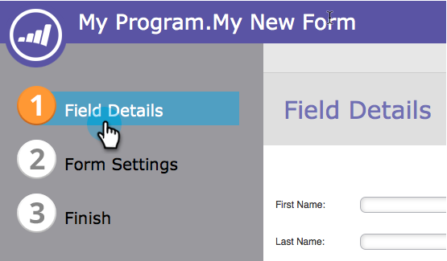
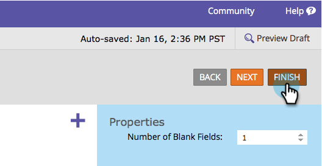

# 設定表單Progressive設定檔分析 {#configure-form-progressive-profiling}

簡短表格很好！ 當有人返回表單時，您可以顯示新欄位並逐步填寫訪客的設定檔。 方法如下。

>[!NOTE]
>
>為了讓此功能正常運作，請確保對可見欄位啟用表單預填，並且 [已停用](/help/marketo/product-docs/demand-generation/forms/form-fields/disable-pre-fill-for-a-form-field.md) 用於隱藏欄位。

1. 前往 **行銷活動**.

   

1. 選取您的表單並按一下 **編輯表單**.

   

1. 下 **表單設定**，按一下 **設定**.

   

1. 設定 **Progressive設定檔分析** 至 **已啟用**.

   

1. 好，現在來設定它。 前往 **欄位詳細資訊**.

   

1. 拖放屬於漸進式設定檔集的所有欄位。

   

1. 移動完所有欄位後，看起來應該像這樣：

   

   >[!NOTE]
   >
   >外部欄位 **Progressive設定檔分析** 方塊會一律顯示在表單中，即使已填寫亦然。

1. 選取 **Progressive設定檔分析** 方塊。

   

   >[!CAUTION]
   >
   >在Progressive Profiling中使用必要欄位時，請務必小心。 如果訪客在先前提交其他欄位的資料後輸入新的電子郵件地址（這將建立新人員），這些欄位仍可留空，因為它們將在最新表單上隱藏。

1. 現在選擇您希望人們從中選擇多少個空白欄位 **Progressive設定檔分析** 方塊。

   

   >[!NOTE]
   >
   >如果您選擇 **數字** **之** **空白** **欄位** 若設為1，訪客第一次看到此表單時，將會看到下列內容：
   >
   >* 名字（空白）
   >* 姓氏（空白）
   >* 電子郵件地址（空白）
   >* 電話號碼（空白）
   >
   >假設他們填寫每個欄位，在第二次造訪時，將會看到：
   >
   >* 名字（預填）
   >* 姓氏（預填）
   >* 電子郵件地址（預填）
   >* 行動電話號碼（空白）
   >
   >假設他們填寫行動電話號碼，則他們第三次造訪時將會看到：
   >
   >* 名字（預填）
   >* 姓氏（預填）
   >* 電子郵件地址（預填）
   >* 國家/地區（空白）

1. 按一下 **完成**.

   

1. 按一下 **核准並關閉**.

   

做得好！ 您剛才所做的工作將獲得回報。

請試用此功能，並確實進行測試。 這是進階功能，但您可以透過此方式讓表單變得非常動態。
