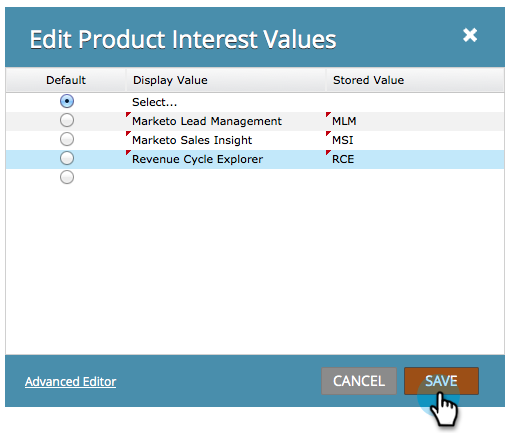

# 定義表單中單選或所選欄位的值 {#define-values-in-a-radio-or-selected-field-in-a-form}

一旦您[將欄位型別](/help/marketo/product-docs/administration/field-management/change-the-type-of-a-marketo-custom-field.md)設定為選項按鈕或選取型別，您就會想要定義使用者可選擇的值。 方法如下。

1. 前往 **[!UICONTROL Marketing Activities]**。

   

1. 選取您的表單並按一下&#x200B;**[!UICONTROL Edit Form]**。

   

1. 選取欄位並按一下&#x200B;**[!UICONTROL Edit]**。

   

   >[!NOTE]
   >
   >第一個和預設值一律為&quot;[!UICONTROL Select...]&quot;，請隨意編輯。 如果您將預設選項按鈕變更為其他列，&quot;[!UICONTROL Select...]&quot;將不會在表單中顯示為選項。

1. 按一下以新增您的值。

   

   >[!NOTE]
   >
   >**定義**
   >
   >**[!UICONTROL Display Value]：**&#x200B;向訪客顯示的內容。
   >
   >**[!UICONTROL Stored Value]：** Marketo中的記錄內容。

1. 新增您需要的值，然後按一下&#x200B;**[!UICONTROL Save]**。

   >[!NOTE]
   >
   >如果您未輸入[!UICONTROL Stored Value]，Marketo將會使用[!UICONTROL Display Value]並加以儲存。

   

   >[!TIP]
   >
   >如果您需要，請按一下&#x200B;**[!UICONTROL Advanced Editor]**&#x200B;以複製/貼上值清單。 它可以成為即時節省工具。

1. 按一下「**[!UICONTROL Finish]**」。

   

1. 按一下「**[!UICONTROL Approve and Close]**」。

   
