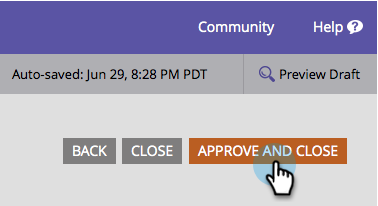

# 定義表格中無線電或選取欄位的值 {#define-values-in-a-radio-or-selected-field-in-a-form}

一旦您 [設定欄位型別](/help/marketo/product-docs/administration/field-management/change-the-type-of-a-marketo-custom-field.md) 若要成為選項按鈕或選取型別，您將要定義使用者可選取的值。 方法如下。

1. 前往 **行銷活動**.

   

1. 選擇您的表單並按一下 **編輯表單**.

   

1. 選取欄位並按一下 **編輯**.

   

   >[!NOTE]
   >
   >第一個和預設值一律為「選取……」 歡迎編輯此內容。 如果您將預設選項按鈕變更為其他列，「選取……」將不會在表單中顯示為選項。

1. 按一下以新增您的值。

   

   >[!NOTE]
   >
   >**定義**
   >
   >**顯示值：** 向訪客顯示的內容。
   >
   >**儲存值：** Marketo的錄製內容。

1. 視需要新增任意數量的值，然後按一下 **儲存**.

   >[!NOTE]
   >
   >如果您未輸入「預存值」，Marketo將會使用「顯示值」並加以儲存。

   

   >[!TIP]
   >
   >按一下 **進階編輯器** 以複製/貼上值清單。 它可以成為即時節省工具。

1. 按一下 **完成**.

   

1. 按一下 **核准並關閉**.

   

超強工作！ 您做得非常好。
