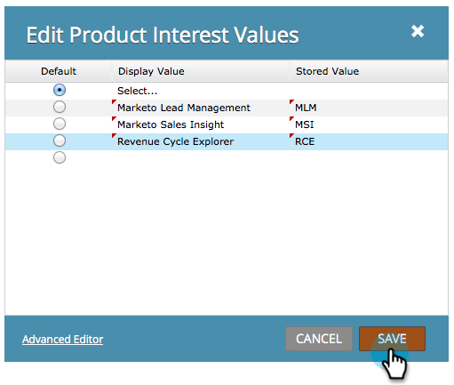

# 以{#define-values-in-a-radio-or-selected-field-in-a-form}格式定義單選按鈕或選定欄位中的值

在[將欄位類型](/help/marketo/product-docs/administration/field-management/change-the-type-of-a-marketo-custom-field.md)設定為單選按鈕或選擇類型後，您將需要定義用戶可以選擇的值。 這是方法。

1. 前往&#x200B;**行銷活動**。

   

1. 選擇表單並按一下「編輯表單」。****

   

1. 選擇該欄位，然後按一下&#x200B;**編輯**。

   

   >[!NOTE]
   >
   >第一個和預設值一律是「選取……」 您可以隨時編輯。 如果您將預設選項按鈕變更為另一行，請「選取……」 不會在表單中顯示為選擇。

1. 按一下以新增值。

   

   >[!NOTE]
   >
   >**定義**
   >
   >**顯示值：** 對訪客顯示的內容。
   >
   >**儲存值：** Marketo中記錄的項目。

1. 根據需要添加任意數量的值，然後按一下「保存」。****

   >[!NOTE]
   >
   >如果您未輸入儲存值，Marketo會使用顯示值並儲存該值。

   

   >[!TIP]
   >
   >如果需要，按一下&#x200B;**高級編輯器**&#x200B;複製／貼上值清單。 它可以節省即時。

1. 按一下&#x200B;**完成**。

   

1. 按一下「核准並關閉」。****

   

超級工作！ 你做得很好。
