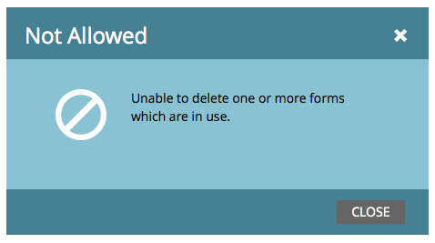

# 刪除表單 {#delete-a-form}

如果您有不需要且未使用的表格，則可加以刪除。 這是方法。

1. 前往「行 **銷****活動」**。

   

1. 尋找並選取表格。

   

1. 在「表 **單****操作」下**，單 **擊「刪** 除表單 ****」。

   

   >[!NOTE]
   >
   >**提醒**
   >
   >
   >請記得從任何／所有著陸頁面中移除表單。 此外，請確認表單未用於公開網站。

1. 按一下「刪 **除」確認**。

   

1. 如果表單正用於Marketo登陸頁面，您將無法加以刪除。 您必須從它所在的任何登陸頁面中移除它。

   

>[!CAUTION]
>
>如果您刪除公開網站使用的表單，您不會看到警告，表單將會中斷。 請考 [慮改為封存](../../../../product-docs/email-marketing/drip-nurturing/using-stream-content/archive-and-unarchive-stream-content.md) 。

