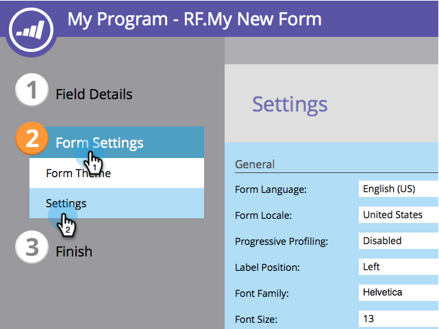

# 停用社交表單填寫 {#disable-social-form-fill}

有時候您不再希望網站訪客使用社交設定檔提交表單。 下面是如何禁用它。

>[!AVAILABILITY]
>
>並非所有客戶都購買過此功能。

1. 前往 **行銷活動**.

   

1. 選取您的表單並按一下 **編輯表單**.

   

1. 在「表單設定」下，按一下 **設定**.

   

1. 清除您不想加入之社交網路的核取方塊。

   

1. 按一下 **完成**.

   

1. 按一下 **核准並關閉**.

   

   你只需做這個。
